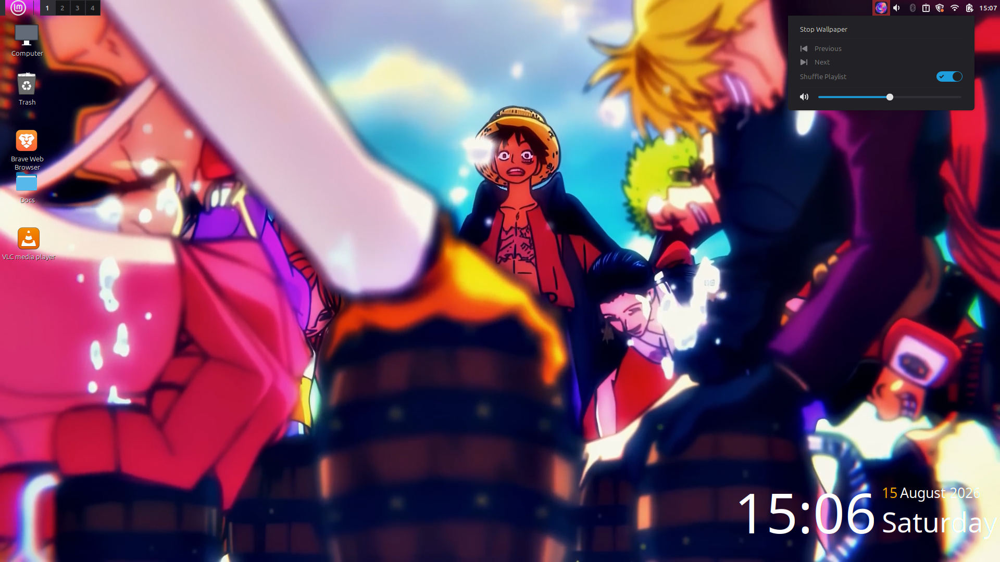
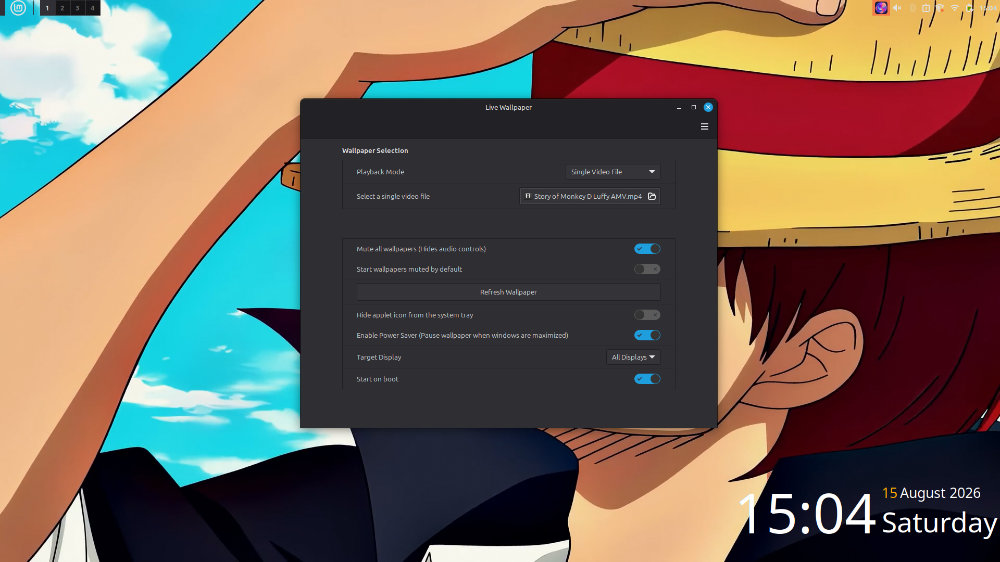

# Live Wallpaper Applet for Cinnamon Desktop

[](https://projects.linuxmint.com/cinnamon/)
[](LICENSE)
[](#-prerequisites--dependencies)

A feature-rich, high-performance Cinnamon Desktop Applet that sets smooth video wallpapers on Linux Mint and other Cinnamon-based Linux distributions. Powered by `mpv` and `xwinwrap`, it features smart power-saving, multi-monitor support, custom playlists, random shuffle playback, and live audio/media controls right from your system tray.

---

## 📸 Preview & Demo

### 📽️ Video Demonstration
Watch the **Live Wallpaper Applet** in action with seamless desktop video rendering, auto-pausing power saver, and system tray controls:

[Live Wallpaper Demo](https://github.com/user-attachments/assets/beae260c-31b1-4ca1-a80c-93fd1bef5868) 

---

### 🖼️ Screenshots

| Panel Popup Controls | Configuration & Settings |
| :---: | :---: |
|  |  |
| *Quick access to start/stop, skip tracks, toggle shuffle, and volume controls* | *Configure video files, folders, playlists, power saver, and display targets* |

---

## ✨ Features

- 🎥 **Multiple Playback Modes**:
  - **Single Video File**: Play your favorite video loop continuously.
  - **Folder of Videos**: Automatically cycle through video files in a specified directory.
  - **Custom Playlist**: Build and re-order custom video playlists directly from applet settings.
- 🔀 **Playlist Shuffle Mode**: Toggle shuffle on/off directly from the panel popup menu or applet settings for randomized playback order.
- ⚡ **Smart Power Saver (Auto-Pause)**: Automatically pauses video playback when windows are maximized or fullscreen on your active display to conserve GPU & CPU resources.
- 🖥️ **Multi-Monitor Support**: Target a specific display (Display 1, Display 2, etc.) or stretch across all displays.
- 🎵 **Flexible Audio & Volume Controls**:
  - **Integrated Volume Slider**: Compact volume bar with a clickable mute/unmute icon right inside the panel popup menu.
  - **Start Muted Option**: Launch wallpapers in silent mode by default with easy un-muting when needed.
  - **Global Audio Mute**: Option to completely hide audio controls and silence all playback (`--mute=yes`).
- ⏭️ **Playlist Navigation**: Skip to the next or previous video in folder or custom playlist mode directly from the applet menu.
- 🖼️ **Seamless Desktop Layering**: Uses `xdotool` to ensure the live wallpaper window renders beneath desktop icons and waits for desktop (`nemo-desktop`) and audio (`PulseAudio`/`PipeWire`) server readiness on boot.
- 🔄 **Live Refresh Button**: Instantly reload playback settings from the configuration menu.
- 🧹 **Clean Process Management**: Automatic process cleanup on startup, reload, or applet removal to prevent orphaned `mpv` or `xwinwrap` processes.
- 🚀 **Autostart & Desktop Sync**: Automatically starts wallpaper playback on boot as soon as desktop and audio services are ready.
- 🎨 **Minimal & Non-Intrusive**: Option to hide the panel icon for a clean system tray.

---

## 🛠️ Prerequisites & Dependencies

The applet requires the following packages:
- **`mpv`**: Lightweight video player backend.
- **`xwinwrap`**: Utility to render video windows directly onto the desktop background (`desktop window`).
- **`socat`**: Socket communication utility for live IPC commands.
- **`xdotool`**: Window management tool to lower wallpaper window layering below desktop icons and monitor server readiness.

---

## 📥 Installation

### 1. Clone or Download the Repository

```bash
git clone https://github.com/Bhavin-Viramgama/cinnamon-live-wallpaper.git
cd cinnamon-live-wallpaper
```

### 2. Copy the Applet Directory

Copy the applet files directory to your local Cinnamon applets directory:

```bash
mkdir -p ~/.local/share/cinnamon/applets/
cp -r CinnamonLiveWallpaper@bhavin-viramgama/files/CinnamonLiveWallpaper@bhavin-viramgama ~/.local/share/cinnamon/applets/
```

### 3. Install Required Dependencies

An automated dependency installation script is provided inside the applet directory:

```bash
chmod +x ~/.local/share/cinnamon/applets/CinnamonLiveWallpaper@bhavin-viramgama/install-deps.sh
~/.local/share/cinnamon/applets/CinnamonLiveWallpaper@bhavin-viramgama/install-deps.sh
```

> **Manual Package Installation (Ubuntu / Debian / Linux Mint):**
> ```bash
> sudo apt update
> sudo apt install -y mpv socat git make gcc libx11-dev libxext-dev libxrender-dev xdotool
> ```
> *If `xwinwrap` is not available in your package repository, the `install-deps.sh` script will automatically compile and install `xwinwrap` from source.*

### 4. Enable the Applet

1. Open **System Settings** -> **Applets** (or right-click your panel and select *Add applets to the panel*).
2. Locate **Live Wallpaper** under the installed applets list.
3. Click the **`+`** button to add it to your panel.
4. Right-click the applet icon and select **Configure** to select your video file or playlist.

### 5. Uninstallation

To completely remove the applet from your system:

1. Right-click the applet icon on your panel and select **Remove 'Live Wallpaper'**.
2. Delete the applet directory:
   ```bash
   rm -rf ~/.local/share/cinnamon/applets/CinnamonLiveWallpaper@bhavin-viramgama
   ```
3. Restart Cinnamon (`Alt` + `F2`, type `r`, `Enter`).

---

## ⚙️ Configuration & Settings

Open the Applet Settings panel to customize playback and behavior:

### 📄 Wallpaper Selection
| Setting | Type | Description |
| :--- | :--- | :--- |
| **Playback Mode** | Dropdown | Choose between `Single Video File`, `Folder of Videos`, `Custom Ordered Playlist`, or `Manual Custom Path`. |
| **Select a single video file** | File Chooser | Pick a video file (`.mp4`, `.mkv`, `.webm`, `.avi`, etc.). |
| **Select a folder of videos** | Folder Chooser | Select a folder containing your video wallpaper collection. |
| **Custom Ordered Playlist** | Interactive List | Add, arrange, and re-order individual video files into a custom playlist. |
| **Manually enter an exact path** | Text Entry | Direct path input for custom file paths or URLs. |
| **Shuffle Playlist** | Switch | Randomly shuffles playback order for folder or playlist mode. |

### 🖥️ Display & Behavior
| Setting | Type | Description |
| :--- | :--- | :--- |
| **Enable Power Saver** | Switch | Automatically pauses playback when any window is maximized or fullscreen on the target monitor. |
| **Target Display** | Dropdown | Choose a specific monitor (Display 1, 2, 3, 4) or select "All Displays". |
| **Start wallpapers muted by default** | Switch | Wallpapers launch in muted state upon playback start. |
| **Mute all wallpapers** | Switch | Completely hides audio controls and mutes audio output. |
| **Refresh Wallpaper** | Button | Manually re-applies current playback configuration. |
| **Hide applet icon** | Switch | Hides the applet icon from the system tray panel. |
| **Start on boot** | Switch | Automatically starts wallpaper playback when Cinnamon desktop boots up. |

---

## 🎮 Panel Controls & Menu

Clicking the **Live Wallpaper** panel applet icon opens quick controls:
- ⏯️ **Start Wallpaper / Stop Wallpaper**: Toggle live wallpaper playback.
- ⏭️ **Next Track / Previous Track**: Skip forward or backward in folder or custom playlist modes.
- 🔀 **Shuffle Playlist Switch**: Easily toggle randomized playback on or off on the fly.
- 🔊 **Integrated Speaker & Volume Slider**: Click the speaker icon to toggle Mute/Unmute or drag the slider to adjust volume dynamically.

---

## 📁 Repository Structure

```text
├── CHANGELOG.md             # Version history
├── info.json                # Spices repository metadata
├── README.md                # Applet documentation
├── icon.png                 # Spices catalog icon
├── screenshot.png           # Spices catalog preview image
├── assets/
│   ├── demo.mp4             # Video demonstration
│   ├── screenshot-menu.png  # Popup menu screenshot
│   └── screenshot-settings.png # Applet settings screenshot
└── files/
    └── CinnamonLiveWallpaper@bhavin-viramgama/
        ├── applet.js        # Main Cinnamon Applet logic & IPC controller
        ├── icon.png         # Applet tray icon
        ├── metadata.json    # Applet metadata & UUID
        ├── settings-schema.json # Applet settings UI definition
        └── install-deps.sh  # Automated dependency installer script
```

---

## 🤝 Contributing

Contributions, bug reports, and feature requests are welcome! Feel free to open an issue or pull request.

---

## 📜 License

This project is open-source software licensed under the [GNU General Public License v3.0](LICENSE).
