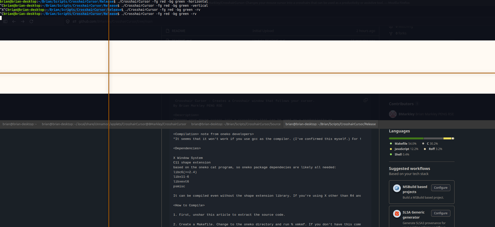

#  CrosshairCursor Cinnamon Applet 
Changes your mouse cursor into a crosshairs that can be used as a productivity or assistive tool. 

## Crosshair Cursor - Creates a Crosshair window that follows your cursor.
By Brian Markley PENG RSE 

### Description
Changes your mouse cursor into a crosshairs that can be used as a productivity or  
assistive tool.  
The <code>CCScript.sh</code> in the applet directory  
<code> ~/.local/share/cinnamon/CrosshairCursor@BMarkley/</code> 
can be modified to add options to the program like changing the colour or style of 
the crosshairs

### Dependencies  
X Window System  
X11 shape extension  
based on the oneko cat program, so oneko package dependecies are likely all needed:  
libc6(>=2.4)  
libx11-6  
libxext6  
psmisc

### Release
Currently in the process of being released as an applet on Linux Mint cinnamon.
Included is a compiled copy of the code which runs on my system.
I think it should be portable to other 64bit systems, but I do not know.

The applet can be manually compiled or installed by following directions on the  
/Bmarkley/CrosshairCursor/ Github page.

### Cinamon Applet
The precompiled release is already included in the applet. If you want to use a custom compiled version  
source code is available at the /BMarkley/CrosshairCursor github page  
please add it to the <code>/applet/CrosshairCursor@BMarkley/files/CrosshairCursor@BMarkley/CrosshairCursor</code> folder
The applet can be installed by running the "test-spice" script found in the applet folder.  
This will install the applet in  
<code> ~/.local/share/cinnamon/applets/CrosshairCursor@BMarkley/CrosshairCursor</code>.   
You can then activate the applet in the cinamon applet menu, by write clicking a panel and  
selecting "applets".
Custom options can be run with the applet by modifying the script <code>CCScript.sh</code>  
found in the applet folder. You may need to make this script and the program executable,  
though the applet.js file should do that for you.
<code> ~/.local/share/cinnamon/applets/CrosshairCursor@BMarkley/CrosshairCursor</code>.   

### Usage
When run without options a light-grey and black fullscreen Crosshair will follow the mouse

Usage can change with options, such as crosshair size, vertical only, horizontal
only, Fixed locations, colours, etc. 
<code>
"Options are:",
"-h or -help                       : display this helpful message.",
"-fg [color]                       : foreground color.",
"-bg [color]                       : background/outline color.",
"-nobg                             : no-background.",
"-rv                               : invert colours.",
"-offset [geometry]                : set x and y offset ex: +2-12.",
"-position [geometry]              : set fixed x and y position. ex: 960x540.",
"-width                            : set the width of the cursor.",
"-height                           : set the height of the cursor.",
"-horizontal                       : horizontal Line only.",
"-vertical                         : vertical line only.",
"-time                             : time between updates in microseconds.",
"-display                          : name of display to draw window to.",
"-name                             : name of process.",
"-sync                             : puts you in synchronous mode.",
</code>
### Special Thanks
CrosshairCursor is written by Brian Markley PENG RSE after a code review of oneko 
and the oneko-toggle applet for cinamon desktop.

Original oneko program written by Masayuki Koba, and Modified by
Tatsuya Kato (kato@ntts.co.jp)

oneko-toggle applet is written by kusch31

### Testing and bug reports
I have only tested this on one computer. My home system running 
Linux Mint 22.3 
Cinamon 6.6.7

Please submit all issues to the Github page /Bmarkley/CrosshairCursor.
