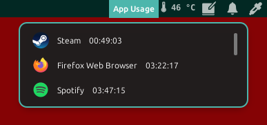

# Daily App Usage
A cinnamon applet displaying app usage during the day

## Manual Instalation
Drop the zip file inside your local cinnamon directory (~/.local/share/cinnamon/applets),
extract the file then refresh cinnamon (alt+f2)

## Note
The applet isn't perfect, this means the user may experience bugs along the way.
One of said bugs is the applet will stop tracking firefox when switching/adding/removing tabs
