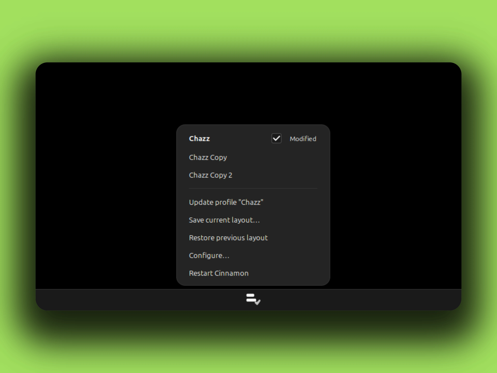
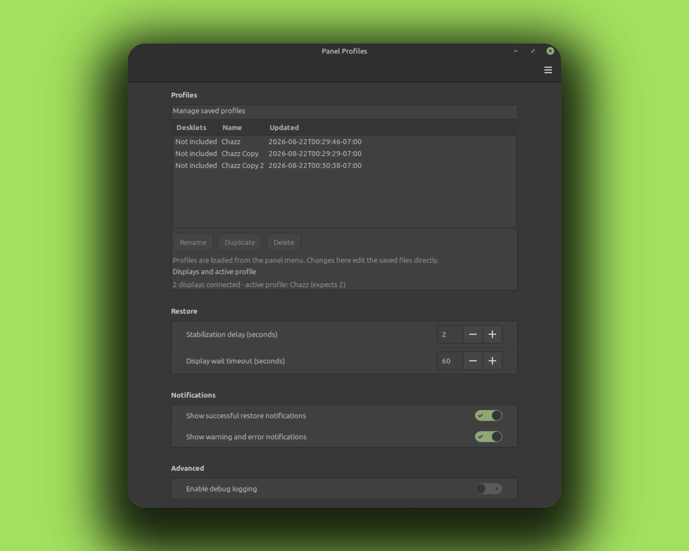

# Panel Profiles

A Cinnamon applet that saves named desktop layouts and restores them later,
exactly. Every profile brings back
panels, monitor placement, heights, autohide, icon and text sizes, every
applet in every zone, their order, and each applet's own settings. A profile
can optionally include the desklet list, desklet settings and each desklet's
own config.

## Screenshots



The settings window:



## Why it exists

Cinnamon usually remembers your panels. It forgets them in one specific place:
a multi-head VM where the second virtual display shows up after Cinnamon has
already started. You reboot the VM, Cinnamon boots with one monitor, and by
the time the second SPICE head appears the second panel and its applets are
gone. You recreate it by hand. Every reboot.

Panel Profiles fixes that. You set the panels up once, save the layout as a
profile, and restore it whenever you want with one click. It is also just
handy as a general layout manager: keep a Minimal profile, a Development
profile, a Presentation profile, and flip between them.

## Features

- One clear profile type: panels and applets, with an optional Include
  desklets checkbox when saving.
- Exact restore: a profile brings back precisely what it was configured to
  include.
- Profiles apply only when you click them. Boot stays Cinnamon's own.
- Modified detection: the menu tells you when the live layout no longer
  matches the active profile, with an Update action.
- Rename, duplicate and delete profiles in the applet's settings window.
- Every load is transactional: a rollback snapshot is taken first and a
  failed restore is undone automatically.
- Restart Cinnamon and Configure entries right in the menu.

## Install

No root needed. The applet lives in your user directory.

From a release package:

```bash
curl -fLO https://github.com/CurbSoftware/cinnamon-panel-profiles-applet/releases/latest/download/cinnamon-panel-profiles-applet.zip
unzip cinnamon-panel-profiles-applet.zip
rm -rf ~/.local/share/cinnamon/applets/cinnamon-panel-profiles-applet@curbsoftware
cp -r cinnamon-panel-profiles-applet@curbsoftware/files/cinnamon-panel-profiles-applet@curbsoftware \
   ~/.local/share/cinnamon/applets/cinnamon-panel-profiles-applet@curbsoftware
```

Or straight from git:

```bash
git clone https://github.com/CurbSoftware/cinnamon-panel-profiles-applet.git
cd cinnamon-panel-profiles-applet
rm -rf ~/.local/share/cinnamon/applets/cinnamon-panel-profiles-applet@curbsoftware
cp -r files/cinnamon-panel-profiles-applet@curbsoftware \
   ~/.local/share/cinnamon/applets/cinnamon-panel-profiles-applet@curbsoftware
```

The `rm -rf` before the copy is the upgrade path: old files are removed so
nothing deleted upstream lingers, then the copy brings the new tree in.
Your applet settings and every saved profile live in
`~/.config/cinnamon/spices/cinnamon-panel-profiles-applet@curbsoftware/` and
`~/.config/cinnamon-panel-profiles/`, both outside the install directory, so
they survive reinstalls.

Restart Cinnamon (**Alt-F2**, type `r`, Enter), then add it to a panel:
right-click a panel, choose Applets, find Panel Profiles, click the plus.

## Use

The short version: save, break it, restore.

1. Set up your panels the way you want them.
2. Click Panel Profiles, then Save current layout, and give it a name.
   Select Include desklets if this layout should restore them too.
3. Change whatever you like: move an applet, resize a panel, add a panel.
4. Click the profile in the menu. It comes back exactly.

The menu opens straight into your profiles. The active profile sits at the
top in bold with a check; the rest follow alphabetically. When the live
layout drifts from it, its row gains a Modified tag and the menu offers an
Update action. Below the list: Restore previous layout, Save current layout,
Configure (the applet's settings window) and Restart Cinnamon.

Rename, duplicate and delete profiles from the applet's settings window
(Configure). The settings also carry a read-only row showing the connected
display count and what the active profile expects.

## Restore behavior

Nothing restores automatically at boot; Cinnamon starts with whatever it
last saved. When you click a profile that expects more displays than are
connected, the applet waits for them (with a timeout) before restoring.

Settings, in the applet's settings dialog:

- Manage saved profiles (rename, duplicate, delete)
- Stabilization delay and display wait timeout for restores
- One automatic rollback snapshot, also available from the applet menu
- Success and warning notifications
- Debug logging

## Where profiles live

Everything is under:

```text
~/.config/cinnamon-panel-profiles/
    state.json
    profiles/<id>.json
    backups/last-good.json
```

- Profiles are the saved snapshots. One JSON file each.
- state.json tracks the active profile plus any in-flight restore.
- backups holds the rollback snapshot written before every load.

Directories are created mode 0700, files mode 0600. That means only your user
can read them.

## Privacy

A profile is not just panel geometry. It includes the raw configuration of
every applet it references, and applet configs can hold things like account
names, tokens, or other private values. Treat profile files as private. Do
not share them without checking what is inside. If you ever add an export
feature or hand a profile file to someone, review it first.

## Troubleshooting

The applet logs with a `[PanelProfiles]` prefix.

- Check `~/.xsession-errors` first: `tail -f ~/.xsession-errors | grep PanelProfiles`.
- `journalctl --user -f` also catches Cinnamon output on systemd sessions.
- Press `Win+L` for Looking Glass, then the Log and Extensions tabs.
- If Cinnamon was started with a custom stderr target during development, the
  log may be in a file like `/tmp/wpN-cinnamon.log` instead. `~/.xsession-errors`
  is the normal home for it.

Recovering a layout: load another profile from the menu. The rollback
snapshot in `~/.config/cinnamon-panel-profiles/backups/` is written before
every load and a failed restore is undone automatically.

Full reset: remove the state directory. The applet rebuilds it on next start.

```bash
rm -rf ~/.config/cinnamon-panel-profiles
```

Your panel layout itself is untouched by that; you only lose the saved
profiles and which ones were active.

If `state.json` is damaged, the applet renames it to a timestamped `.corrupt`
file, recreates a safe default, and leaves profile files untouched. If a
profile JSON is damaged, other profiles still load. Selecting the broken one
does not change Cinnamon.

## Development

See `DEVELOPMENT.md` for the module map, test commands and the live-test
workflow. Schema notes are in `docs/SCHEMA.md`. Manual VM checks are in
`docs/TESTING.md`. Live Cinnamon 6.6.9 inspection notes are in `RESEARCH.md`.
