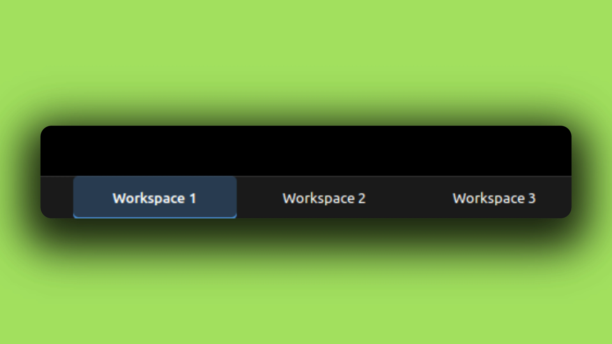
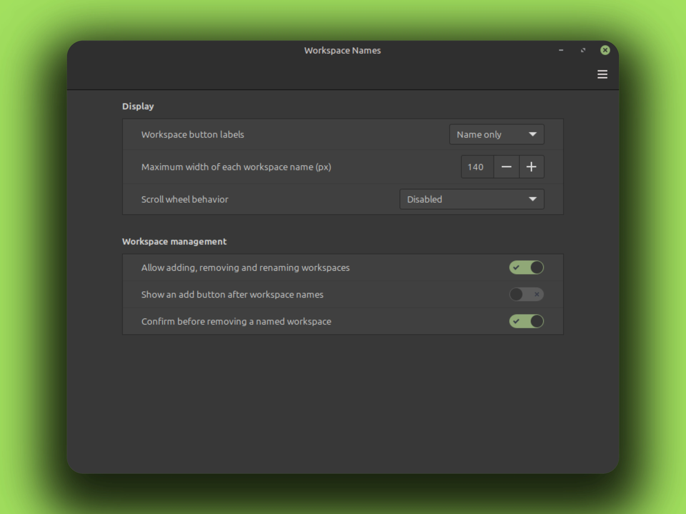

# Workspace Names Applet

Workspace Names puts every workspace directly on a Cinnamon panel. Each named
button switches to its workspace with one click. The active workspace uses the
panel theme's outlined state.

## Screenshots



The settings window:



## Features

- One visible button per workspace
- Name, number, or number and name labels
- Horizontal and vertical panel layouts
- Density-aware label bounds with compact vertical name prefixes
- Full-name tooltips and accessible button names
- Optional trailing add button
- Disabled, normal, or reversed scroll switching
- Expo, add, rename, and remove actions in the standard applet menu
- Live updates after workspace add, remove, reorder, rename, or switch

## Settings

Open Cinnamon Settings, then Applets, then Workspace Names.

- Workspace button labels
- Maximum workspace name width
- Scroll wheel behavior
- Workspace editing controls
- Named workspace removal confirmation

Existing installations keep the same UUID. The former scroll checkbox is
migrated once to the new three-state scroll setting.

## Manual install

No root needed. Everything installs into your home directory.

From a release package:

```bash
curl -fLO https://github.com/CurbSoftware/cinnamon-workspace-name-applet/releases/latest/download/cinnamon-workspace-name-applet.zip
unzip cinnamon-workspace-name-applet.zip
rm -rf ~/.local/share/cinnamon/applets/cinnamon-workspace-name-applet@curbsoftware
cp -r cinnamon-workspace-name-applet@curbsoftware/files/cinnamon-workspace-name-applet@curbsoftware \
   ~/.local/share/cinnamon/applets/cinnamon-workspace-name-applet@curbsoftware
```

Or straight from git:

```bash
git clone https://github.com/CurbSoftware/cinnamon-workspace-name-applet.git
cd cinnamon-workspace-name-applet
rm -rf ~/.local/share/cinnamon/applets/cinnamon-workspace-name-applet@curbsoftware
cp -r files/cinnamon-workspace-name-applet@curbsoftware \
   ~/.local/share/cinnamon/applets/cinnamon-workspace-name-applet@curbsoftware
```

The `rm -rf` before the copy is the upgrade path: old files are removed so
nothing deleted upstream lingers, then the copy brings the new tree in. Your
settings are stored separately in
`~/.config/cinnamon/spices/cinnamon-workspace-name-applet@curbsoftware/`
and survive reinstalls.

Restart Cinnamon (**Alt-F2**, type `r`, Enter) and enable the applet in
Cinnamon Settings, Applets.

## Testing

```sh
gjs dev-tools/test-workspace-actions.js
python3 dev-tools/live-test-applet.py
```
