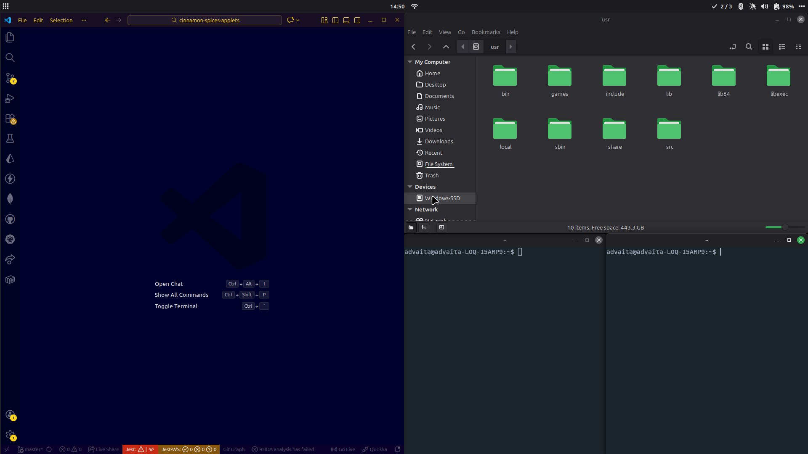

# Curtain Applet for Cinnamon
## Introduction
The **Curtain** applet for Cinnamon is designed to be a lightweight,fast and easy to install and configure alternative to popular window managers. Essentially, it is aimed to completely navigate workspaces and windows using only the keyboard.


## Features
### Workspace Management
- **Switch workspaces**: Switch between workspaces using the ```Super + 1-9``` keys
- **Move Windows To A Workspace**: Move the <b>focused</b> window to any workspaces using the ```Super+Shift+1-9```keys
- **Navigate between next and previous workspaces**: Alternatively it is possible to move to previous and next workspaces using ```Super + R/T``` and move the windows to previous and next workspaces using ```Super + Shift + R/T``` (R for previous and T for next workspace)

### Window Management
- **Arrange the Windows**: Arrange the windows in [Half Window Fashion](#half-window-manager) by using ```Super + Tab```
- **Focus the window** : focus on [next window](#next-window-in-half-window-manager) using ```Super + F```
- **Move the window** : Move the <b>focused</b> window in direction of the largest window equal or less than the focused window using ```Super + M```
- **Swap the window**:  Swap the <b>focused</b> window with the [next window](#next-window-in-half-window-manager) using ```Super + S```
- **Half Screen**: Make the <b>focused</b> window occupy left half of the screen and arrange the rest of the windows(SEE WindowManagement > Arrange the Windows) using ```Super+H```
- **Maximize**: Make the <b>focused</b> window occupy whole screen/maximize using ```Super+L```
- **Exit from Maximize**: Unmaximize the <b>focused</b> window using ```Super+Q```
- **Minimize**: Minimize the <b>focused</b> window using ```Super + P```
- **Close the Focused Window**: Close the <b>focused</b> window using ```Super+K```

### Other Settings
- **Enable/disable**: Automatic arrangement on opening/closing a window as well as Hotkeys can be toggled on/off using ```Super + Escape```

### Configure your own hotkeys
- To open an application like kitty,Nemo etc. you can go to System Settings > Keyboard > Shortcuts > Custom Shortcuts

### Automatic Arrangement 
- If the windows are in arranged fashion i.e no sizing and position of any window is changed, then the newly opened windows also open in [Half Window Fashion](#half-window-manager). 
- **Note - this is only possible when the windows themselves allow resizing and positioning. If any of the opened windows(newly opened or already opened) cannot resize or position itself according to the algorithm, the automatic arrangement fails and windows are opened/resized randomly. This is especially true for applications like gnome-terminal which only resizes itself vertically in multiple of font size and winddows having a set minimum size."**

### See the applet status
- See whether the extension is enabled or not, current workspace index, as well as total workspaces


### Fully customizable
- The keys for performing all the action are fully customizable 

## Preferences
Due to individual windows not following **Curtain** rules ,it is advisable the following applications are preferred: 
- kitty over gnome-terminal

## Half Window Manager
The **Curtain** applet arranges the windows using the following rules: 
- Sort the windows by their size. If two windows are of same size the one that is on left or top comes first
- Windows are arranged starting from the full screen
- Arrange the 1st window in half screen either vertically(top or bottom) or horizontally(left or right) depending upon whether the remaining area has lower width(vertically) or lower height(horizontally)

### Next Window in Half Window Manager
- The focus and swap operations in **Curtain** are performed using the current focused window and the next window. The next window is the largest area window which is equal or smaller than the focused window. If no such window exists the next window is the largest area window

## Manual Installation on Cinnamon
To manually install the **Curtain** applet in Cinnamon , follow the steps below:
1.  **Navigate to the Cinnamon applets directory:**
    Open the terminal and use the `cd` command to go to the folder where Cinnamon applets are stored locally:
    ```bash
    cd ~/.local/share/cinnamon/applets
    ```

2.  **Clone the applet repository:**
    Clone the repository using the following command:
    ```bash
    git clone git@github.com:AdvaitaSoni/curtain.git -b APPLET curtain@AdvaitaSoni
    ``` 
    NOTE: The branch to copy is **APPLET**

4.  **Restart Cinnamon (or the panel):**
    For Cinnamon to recognize the new applet, you can restart the graphical environment. The easiest way is to press `Alt + F2`, type `r`, and press `Enter`. This will restart Cinnamon without closing your applications.

5.  **Add the applet to the panel:**
    - Right-click on an empty area of your Cinnamon panel.
    - Select "Add applets to panel...".
    - In the window that opens, go to the "Installed applets" tab.
    - Look for "Curtain" in the list.
    - Select it and click "Add to panel."
Now you should see the "Curtain" applet displaying the remaining minutes of the day on your Cinnamon panel!

## From Applet Store
- Alternatively it is possible to download by going to Applets > Download > Search for Curtain
