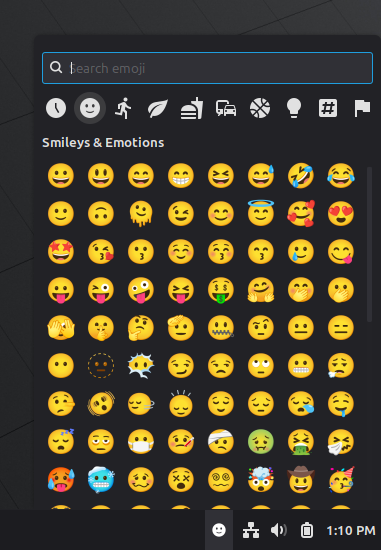

# Emoji Keyboard

Emoji Keyboard is a native Cinnamon panel applet for finding and entering
emoji without opening a separate application. Clicking its symbolic smiley
icon opens a theme-aware popup anchored to the panel.

## Features

- Bundled, searchable catalog of 3,944 Emoji 17 entries
- Eight-column, scrollable grid with Android-style categories: Recent,
  Smileys & Emotions, People, Animals & Nature, Food & Drink, Travel & Places,
  Activities & Events, Objects, Symbols, and Flags
- Recent emoji are remembered between sessions
- Selecting an emoji copies it and inserts it into the previously focused
  application
- Native popup behavior, including dismissal on an outside click
- Theme-aware symbolic icons that follow the panel's icon size
- No network access or background service

## Requirements

- The Cinnamon desktop
- An emoji-capable system font, such as Noto Color Emoji

Automatic insertion uses Cinnamon's virtual keyboard. On sessions where that
isn't available, selecting an emoji still copies it to the clipboard.

## Installation

1. Open **System Settings → Applets**.
2. Select the **Download** tab and install **Emoji Keyboard**.
3. Switch to the **Manage** tab, select the applet, and add it to a panel.

## Usage

1. Click the smiley icon in the panel.
2. Browse a category or type into the search field.
3. Click an emoji.

The emoji is copied to both the regular and primary clipboard, the popup
closes, and `Shift+Insert` is sent through Cinnamon's virtual keyboard to
insert it into the application that previously had focus.

## Configuration

Right-click the applet and choose **Configure...** to change:

- **Copy emoji to clipboard** — when enabled (the default), the selected
  emoji remains on the clipboard after it's inserted. When disabled, the
  clipboard is restored to its previous contents right after insertion.
- **Category icon size** — how large the category icons in the popup are.
  Choose a fixed size, or match the panel's colored or symbolic icon size.
- **Emoji size** — how large emoji appear in the grid. Choose a fixed size,
  or match the panel's colored or symbolic icon size.
- **Default skin tone** — applies a skin tone to emoji that support one
  (people, hand gestures, and similar). Browsing and search show only the
  variant matching this tone; two-tone gestures (e.g. a handshake between two
  different tones) aren't addressable by a single default and are left out.
  Emoji without skin tone variants are unaffected, and previously used emoji
  in **Recent** keep whatever tone was picked at the time.

By default, both sizes match the panel zone's **Colored icon size** setting;
the applet's own panel icon always follows the zone's symbolic icon size.

## Privacy

Emoji Keyboard makes no network requests and launches no external processes.
Its only stored data is the recent-emoji list, kept through Cinnamon's
settings API.

## License

The applet code is licensed under GPL-2.0-or-later.

Emoji names, ordering, and search annotations are derived from
[Unicode Emoji 17 and CLDR data](https://www.unicode.org/emoji/), provided
under the [Unicode License](https://www.unicode.org/license.txt). Emoji artwork
is supplied by the user's system font and is not bundled with this applet.
