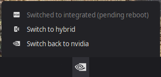
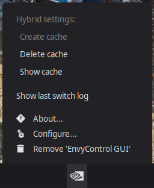
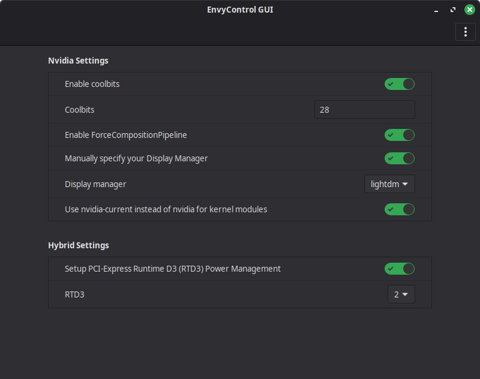

# EnvyControl GUI

This applet acts as a GUI for [EnvyControl](https://github.com/bayasdev/envycontrol) CLI tool, which provides an easy way
to switch between GPU modes on Nvidia Optimus systems.

## Dependencies

- `envycontrol`

## Icons

Icons are based on [Papirus icon theme](https://github.com/PapirusDevelopmentTeam/papirus-icon-theme).

## Screenshots

  
  
  
