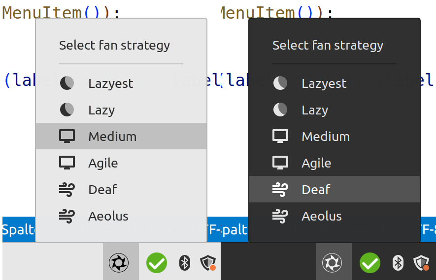

# Framework FanCTRL - Fan Strategy Control Applet for Cinnamon

This applet allows you to control the fan speed strategies of Framework laptops directly from your desktop. It uses [fw-fanctrl](https://github.com/TamtamHero/fw-fanctrl) / framework-ec to select different fan speed strategies. It's a handy tool for managing your laptop's thermal performance / noise.



## Installation

### Via Cinnamon Applet Store

    - Right click on the menu bar.
    - Open "Applets".
    - Click on "Download" tab.
    - Search for "Framework fanCTRL".
    - Click on the install icon next to the applet name.

The applet should now be available in your Applets settings panel. Add it to your panel to start using it.

### Via Git

Open a terminal.

Clone the git repository:

    git clone https://github.com/not-a-feature/fw_fanctrl_applet

Copy the applet to your local Cinnamon applets directory:

    cp -r fw_fanctrl_applet/files/* ~/.local/share/cinnamon/applets/

Restart Cinnamon. You can do this by pressing Alt+F2, typing 'r' in the command box that appears, and pressing Enter.

The applet should now be available in your Applets settings panel. Add it to your panel to start using it.


## Usage

Once installed, click on the applet icon in your panel to open the menu. The menu displays a list of available fan speed strategies. Click on a strategy to select it. The applet will then use fw-fanctrl to apply the strategy.

## Dependencies

This applet requires [fw-fanctrl](https://github.com/TamtamHero/fw-fanctrl) to control the fan speed.

## License
```
Copyright (C) 2023 by Jules Kreuer - @not_a_feature
This piece of software is published unter the GNU General Public License v3.0
TLDR:

| Permissions      | Conditions                   | Limitations |
| ---------------- | ---------------------------- | ----------- |
| ✓ Commercial use | Disclose source              | ✕ Liability |
| ✓ Distribution   | License and copyright notice | ✕ Warranty  |
| ✓ Modification   | Same license                 |             |
| ✓ Patent use     | State changes                |             |
| ✓ Private use    |                              |             |
```
Go to [LICENSE.md](https://github.com/not-a-feature/fw_fanctrl_applet/blob/main/LICENSE) to see the full version.