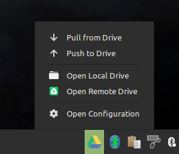

Google Drive Applet for Cinnamon
========

A simple applet to be able to sync Google Drive folders and files with just a few clicks.



## Features

This applet currently supports the following features:

- Pulling files/folders from Google Drive to your PC
- Pushing files/folders from your PC to Google Drive
- Open Google Drive in a browser
- Open your Drive folder location
- Whitelist specific files/folders
  
*NOTE: New features will be coming soon! Make sure to leave your feedback about what you like or want to see in the future updates!*


## Usage Help

#### Installation

**To use the Applet first you need to install the Google Drive library from: https://github.com/odeke-em/drive#installing**

1. Make sure you have the `drive` library installed globaly and can be accessed in the terminal when typing `drive`
2. Go to your desktop and hover over the panel and click the right mouse button
3. From the menu select the `Applets` option
4. Find and download the Applet from the `Download` section
5. Add the applet to the panel and use the configuration window to configure it

#### Configuration

**To configure the Applet, please follow the steps below:**

1. Click the right mouse button while hovering on the Applet
2. Select `Configure` from the menu
3. The config menu will appear where you should be able to change the following:

- Your Drive location - this is the folder where Google Drive files and folders will be synced to.
- Whitelisted folders - if you want to sync only specific files or folders from your Google Drive.

## Bugs/Feedback

If you find any bugs or stability issues please create an
issue [here](https://github.com/pbojan/googledrive-applet-cinnamon/issues) or send an email
to [p.bojan@live.com](mailto:p.bojan@live.com).

If you have ideas for new features or improvements please send an email to [p.bojan@live.com](mailto:p.bojan@live.com).

## Contribute/Donate

If you want to support the work and maintenance of this Google Drive Applet, please consider donating. Every donation
is highly appreciated!

```
BTC: bc1q82zg96fgeenr5ag254lnqt4nn77lzjf5nx9m00
BCH: qq57wcmp7ajgpzgxhme5ldfwwfmkja8qd5mmaf6rlz
LTC: ltc1q362me09lmxfcq6zex6968qsnnq6hz3nhxv4cyr
ETH: 0x1125207ae7d169eb623fa228e5b2c48a6b6482d9
```

**Can't donate, but you still want to help? Here are a few ways how to support this project:**

* Give feedback, report any bug or issue you find
* Improve the Applet by creating a pull request to add new features. If you want to add new features please first send
  an email to [p.bojan@live.com](mailto:p.bojan@live.com) and describe your idea.
* Star/Watch the project on Github
* Spread the word and share this applet with your friends, colleagues, social networks, etc.

## Changelog

Check the changelog here: [Changelog](CHANGELOG.md)

## Credits

1. This applet currently is using the Google Drive library from: https://github.com/odeke-em/drive
