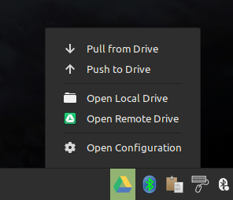

Google Drive Applet for Cinnamon
========

A simple applet to sync Google Drive folders and files with just a few clicks, powered by [rclone](https://rclone.org/).



## Features

- Pull files/folders from Google Drive to your local folder
- Push files/folders from your local folder to Google Drive
- Sync from Drive — makes your local folder match Google Drive
- Sync to Drive — makes Google Drive match your local folder
- Dry-run preview before every action, with confirmation before executing
- Whitelist specific folders to limit sync scope

## Requirements

- [rclone](https://rclone.org/install/) installed and available on `$PATH`
- A Google Drive remote configured in rclone — see the [rclone Google Drive guide](https://rclone.org/drive/)

## Installation

1. Install rclone and set up a Google Drive remote:
   ```
   rclone config
   ```
   Follow the prompts to create a remote (e.g. named `gdrive`). Run `rclone listremotes` to confirm it appears.
2. Copy the applet folder to your Cinnamon applets directory or install it via the Cinnamon Applets interface.
   ```
   cp -r files/googledrive@pbojan ~/.local/share/cinnamon/applets/
   ```
3. Restart Cinnamon: press `Alt+F2`, type `r`, press Enter.

4. Right-click the panel → **Add Applets to Panel** → find and add **Google Drive**.

## Configuration

Right-click the applet → **Configure**:

- **Drive Sync Location** — the local folder where Google Drive files will be synced
- **rclone Remote Name** — the name of your rclone Google Drive remote (e.g. `gdrive`)
- **Whitelist Folders** — optional list of folder names to limit sync to specific folders; leave empty to sync everything

## Bugs/Feedback

If you find any bugs or stability issues please create an issue [here](https://github.com/pbojan/googledrive-applet-cinnamon/issues).

## Contribute/Donate

If you want to support the work and maintenance of this applet, please consider donating. Every donation is highly appreciated!

```
BTC: bc1q82zg96fgeenr5ag254lnqt4nn77lzjf5nx9m00
BCH: qq57wcmp7ajgpzgxhme5ldfwwfmkja8qd5mmaf6rlz
LTC: ltc1q362me09lmxfcq6zex6968qsnnq6hz3nhxv4cyr
ETH: 0x1125207ae7d169eb623fa228e5b2c48a6b6482d9
```

**Can't donate but want to help?**

* Report bugs and give feedback
* Submit a pull request with improvements
* Star the project on GitHub
* Share it with others

## Changelog

Check the changelog here: [Changelog](CHANGELOG.md)

## Credits

This applet uses [rclone](https://rclone.org/) to handle syncing between Google Drive and your local folder.
