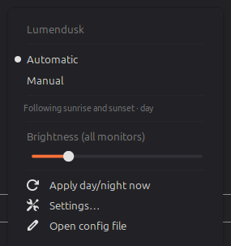

# Lumendusk

Automatic dark/light theme, **night light** (warm color temperature), **and
monitor brightness** — driven by the time of day.

Three things move together as the day turns, with nothing to click:

1. The desktop switches between **light** and **dark** — the shell, panel,
   window borders, GTK/GTK4 apps, Flatpak apps, icons and accent, not just the
   GTK theme.
2. The **night light** warms the screen after dark and turns off in the
   morning.
3. **Monitor brightness** moves to a day level and a dimmer night level
   (optional, off until you turn it on).

Day and night come either from **sunrise and sunset**, computed offline from
your latitude and longitude, or from **fixed times** you set. Sun mode makes no
network calls at all — it works on a plane and on a machine that has never seen
a Wi-Fi network.

## Automatic and Manual

The menu has one switch. In **Automatic** it follows the schedule and reports
what it's doing. Switch to **Manual** and it hands the desktop back to you:
Light / Dark buttons and a night light toggle appear, and nothing changes on
its own until you switch back. That's also the answer to "I want it dark right
now" — the schedule stops arguing with you.

A change you make by hand in Automatic is respected too: brightness you nudge
in the evening stays where you put it until the next transition, rather than
being overwritten every minute.

## Setting it up

Right-click the panel icon → **Configure**. Mode, location (one click detects
it from your system timezone, offline), fixed times, night-light warmth and the
day/night brightness levels are all there.

Prefer dark all day? Set the daytime appearance to Dark. The desktop stays dark
at noon while the night light and brightness still follow the clock.

## Optional system tools

Lumendusk works out of the box; each of these unlocks one more thing.

| Tool | What it adds |
|------|--------------|
| `ddcutil` | Brightness on external monitors over DDC/CI. Needs the `i2c-dev` module and your user in the `i2c` group. |
| `brightnessctl` | Laptop-panel brightness without root. |
| `gammastep` or `xsct` | Night light on setups where Cinnamon's own keys are missing. |

Without any of them you still get theme switching and night light. Brightness
needs one of the two backends above: a monitor with neither is left alone and
told so in the log. Lumendusk will not fake it with gamma dimming, which only
darkens the picture while the backlight stays where it was.

## Notes

- The engine ships inside the applet, so there is nothing to install and no
  Python packages to add. If you also have Lumendusk installed from source, the
  applet uses that copy instead, so your edits take effect.
- Settings live in `~/.config/lumendusk/config.toml` — the menu has an "Open
  config file" item — and the log is at
  `~/.local/state/lumendusk/lumendusk.log`.
- An external monitor that stops answering over DDC/CI is skipped for five
  minutes rather than waited on at every change, because failure there is slow
  failure. Power-cycling the monitor clears it immediately.

## Links

- Source, issues and full documentation:
  <https://github.com/Kasun24/lumendusk>
- License: MIT
