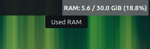

# Moderately Advanced RAM Monitor

A high-performance, customizable RAM monitor for the Cinnamon Desktop Environment. Designed with visual stability and system efficiency in mind.

## Key Features

- **Kernel-Direct Data**: Reads memory statistics directly from `/proc/meminfo`. This ensures maximum accuracy and near-zero CPU overhead compared to spawning external processes like `free` or `top`.
- **Visual Stability Control**: Includes a "Monospace Mode" with customizable string padding. This prevents the panel from "jumping" or shifting when memory values change (e.g., switching from 9.9% to 10.0%).
- **Customizable Alerts**: Visual blinking warnings when RAM usage exceeds (or available memory falls below) user-defined thresholds.
- **Smart Interaction**: Left-click to launch your favorite system monitor (GNOME System Monitor, htop, btop, etc.).
- **Unit Flexibility**: Support for both Binary (GiB) and Decimal (GB) units.

## Installation

1. Copy the `ma-ram-monitor@lanote` folder to `~/.local/share/cinnamon/applets/`.
2. Enable the applet in **Cinnamon Settings -> Applets**.
3. (Optional) Configure the layout and alerts in the applet settings.

## Technical Details

The applet utilizes the following Linux kernel metrics:

- **MemTotal**: Total usable RAM.
- **MemAvailable**: An estimate of how much memory is available for starting new applications, without swapping.

## Translations

- English (Default)
- Polish (Full support)

## License

This project is distributed under the same license as the Cinnamon Desktop environment (GPLv2+).
