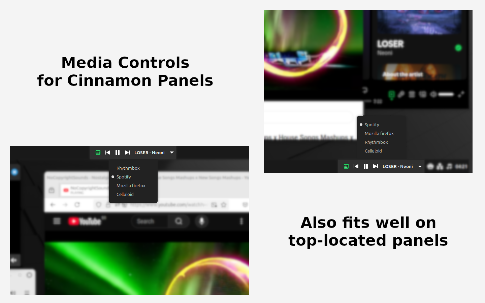

# Media Controls

Adds multimedia controls to your Cinnamon panels.

Inspired by Gnome Shell's [Media Controls by Sakith B.](https://extensions.gnome.org/extension/4470/media-controls/) extension.

### About the Author

[RBFraphael](https://github.com/rbfraphael) - Fullstack web developer with years of experience in PHP & JavaScript. Wanted such feature on Cinnamon for a long time, but never found a good alternative. After some thinking (and some help from AI LLMs), he build its first Cinnamon Applet: Media Controls.

### About the Extension

- It shows all running players that works with MPRIS2 protocol
- You can toggle the active player by clicking at the appet on your panel
- Fits well on top and bottom panels
- Inspired by Gnome Shell's [Media Controls by Sakith B.](https://extensions.gnome.org/extension/4470/media-controls/) extension.
- Used a lot the original [sound@cinnamon.org](https://github.com/linuxmint/cinnamon/tree/master/files/usr/share/cinnamon/applets/sound%40cinnamon.org) applet as reference
- Created for a personal wanting, with help from Google Gemini and OpenAI ChatGPT

### Changelog

#### 1.1.0
Special thanks to [@lumapu](https://github.com/lumapu) for its [ideas and contributions](https://github.com/linuxmint/cinnamon-spices-applets/pull/8276).
- Settings menu added
- Option to show/hide player icon
- Option to show/hide track info on panel
- Option to define which track details to display
- Options to limit the size of the displayed media details
- Option to show/hide player selector button
- Option to enable/disable hover color on buttons
- Hover color selector

#### 1.0.0
- First version
