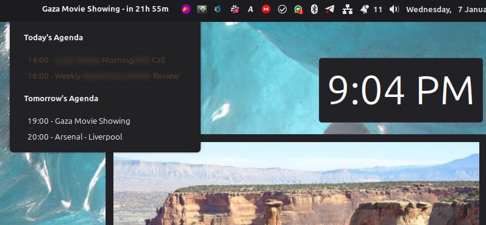
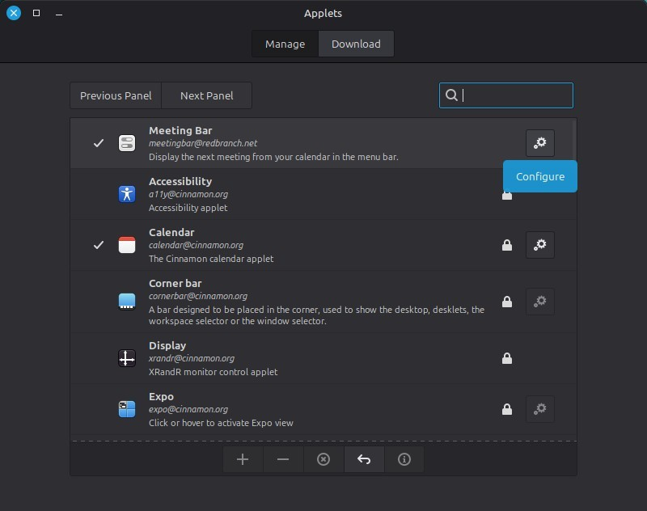
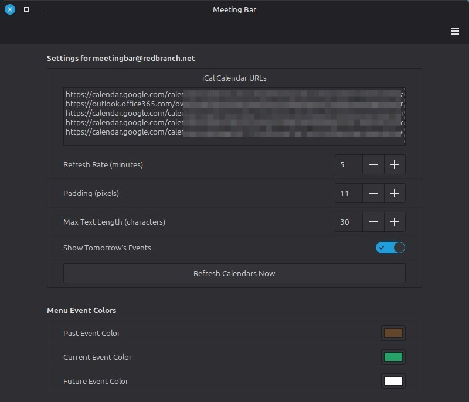

# meetingbar-applet

An applet to display the next event from a calendar on a panel on the Cinnamon desktop. Avoid missing your next meeting !




## Configuration

Once the applet files are in place you can add the applet to a panel by right-clicking the panel and choosing 'Add Applets'. The settings for the applet can be configured using the cog icon.



Paste the URL for each calendar into the text box with one calendar address per line.



## Features

- Displays the next upcoming item from a calendar
- Configurable colours for the text in the applet
- Optionally show events for the next day
- Configurable padding to help you position the applet text if needed
- Configurable rate for refreshing the calendar events

## Troubleshooting

If you have any issues you should be able to see the logs from the applet in the file:

```
~/.xsession-errors
```
