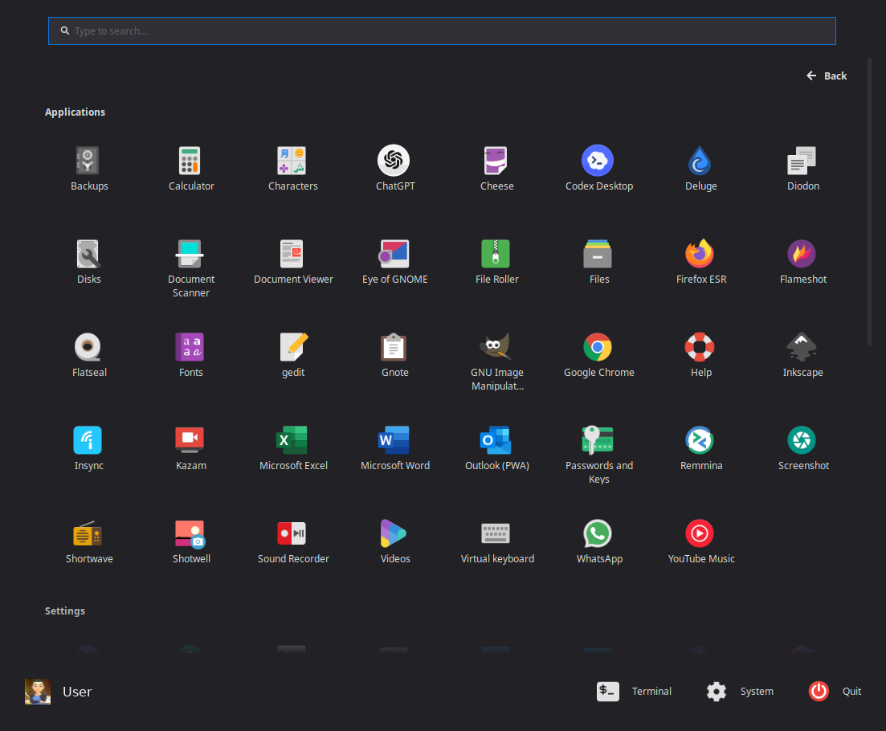
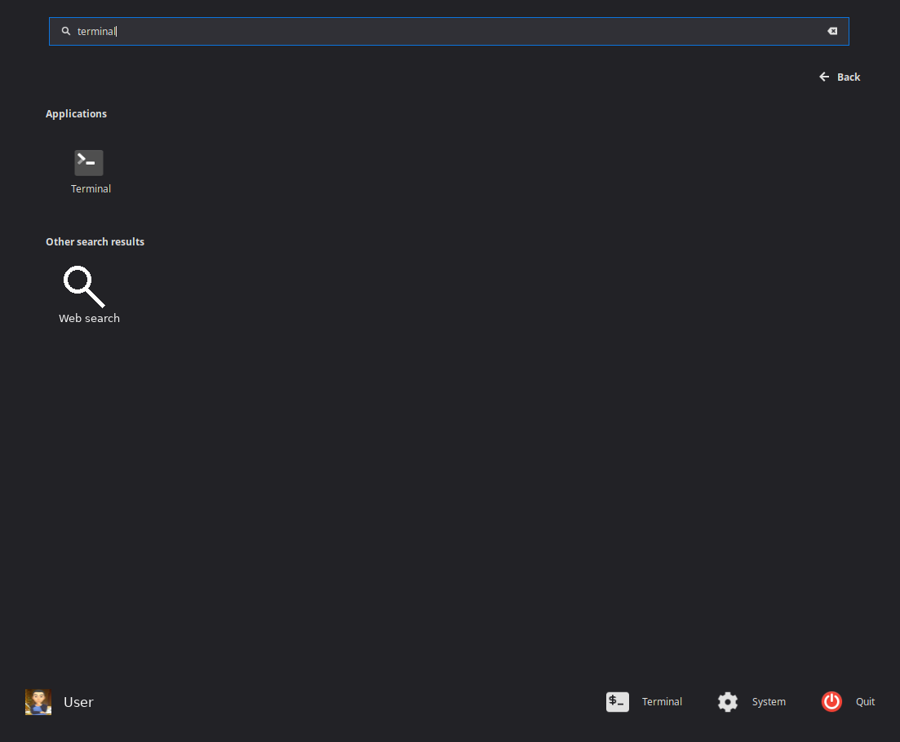

# Menu Eleven Reloaded

A Windows 11-inspired application menu for Cinnamon 6.0.

## Project roles

- **Maintainer of this fork:** dshep79
- **Immediate upstream:** MenuEleven/Cinnamenu11 by David Banting
- **Original Cinnamenu creator:** Jason Hicks

See `6.0/CREDITS` for the full attribution chain.

## Install

1. Extract `menuelevenreloaded@dshep79` into:
   `~/.local/share/cinnamon/applets/`
2. Open **System Settings → Applets**.
3. Add **Menu Eleven Reloaded** to a panel.

The independent UUID means it can be installed alongside `menueleven@djb`.

## Screenshots

### Main menu

### Search results

## Privacy and network access

Optional search features can query configured web search engines, DuckDuckGo
suggestions, Google suggestions, and Wikipedia. Browser bookmark/history
features read supported browser databases locally. Favicons are cached under
the user's XDG cache directory.

## Artwork

The package contains no search-provider or other company logos. Its applet
icon is an original generic white menu mark created for this fork. Search and
calculator results use generic symbolic icons supplied by the user's desktop
icon theme.

## License

GPL-3.0-only. The complete licence text is included in `COPYING`. Upstream
authors, borrowed components, and modifications remain documented in
`6.0/CREDITS`.
