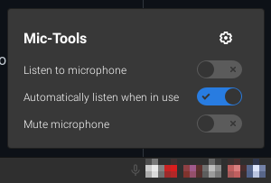
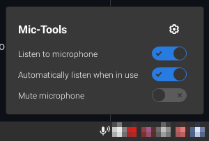

# Mic-Tools Cinnamon Applet

This applet adds some extra tools for your microphone to the tray. You can listen to what your microphone picks up and you can mute the microphone from this applet. It even allows you to automatically listen to your microphone when it is used by another application.

## Requirements

This Applet requires `amixer` and `pactl`. Test out if you have them with the following two commands:

```sh
amixer --version
pactl --version
```

## Installation

1. Download this repository.
2. Copy the folder `files/mic-tools@chaptergy` to `~/.local/share/cinnamon/applets/mic-tools@chaptergy`.
3. Right-click on your panel where you want to add this applet, and click _Applets_. A new window will open.
4. Select _Mic-Tools_ from the list, and then click on the plus icon at the bottom.
5. You're done! You should now see a microphone icon in your panel.

To change settings like switching between dark and light icons, right click on the icon and select _Configure..._

## Screenshots



