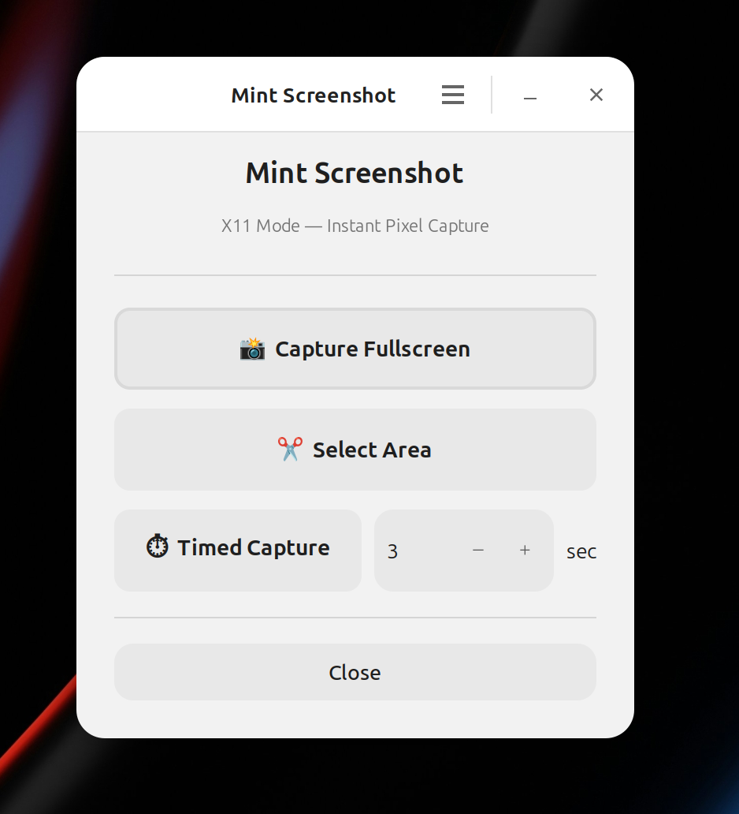

# Mint Screenshot

A modern screenshot and annotation applet for Cinnamon. Capture your screen, annotate with shapes, arrows, and text, then save or copy to clipboard — all from a single streamlined workflow.



## Why Mint Screenshot?

The default Cinnamon screenshot tool (`gnome-screenshot`) captures the screen but offers **no built-in annotation**. You have to open a separate image editor just to draw an arrow or highlight something. Mint Screenshot solves this by combining capture and annotation into one tool:

| Feature | Default Screenshot Tool | Mint Screenshot |
|---------|------------------------|-----------------|
| Fullscreen capture | ✅ | ✅ |
| Area selection | ✅ | ✅ (live preview with dimmed overlay) |
| Timed capture | ✅ (fixed delays) | ✅ (1–999s, custom countdown with floating pill) |
| Window capture | ✅ | ✅ (X11) |
 **Wayland support** | ✅ | ✅ Via XDG Desktop Portal |
| **Draw annotations** | ❌ | ✅ Rectangles, ellipses, arrows, freehand, highlights |
| **Add text** | ❌ | ✅ Resizable text with Pango rendering |
| **Crop after capture** | ❌ | ✅ Drag handles to adjust region |
| **Undo/Redo** | ❌ | ✅ Full history with Ctrl+Z/Y |
| **Color palette** | ❌ | ✅ 6 colors, adjustable line width |
| **Move/resize/rotate** | ❌ | ✅ Per-annotation context toolbar |
| **Delete annotations** | ❌ | ✅ Delete key or toolbar button |
| **HiDPI support** | Partial | ✅ Pixel-perfect on scaled displays |
| **Save format options** | PNG only | ✅ PNG, JPG, GIF with quality presets |
| **Panel integration** | No panel applet | ✅ Native Cinnamon panel applet |

## 🌟 Key Features

- **Cross-Platform Compatibility**: Fully supports both **X11** and **Wayland** (via `xdg-desktop-portal`).
  - *Note on Wayland:* Interactive "Select Window" mode is currently disabled on Wayland because its strict security architecture intentionally blocks third-party apps from reading window locations. Wayland users can continue to use "Select Area" or Fullscreen modes seamlessly.
- **Multiple Capture Modes**: Fullscreen, interactive region selection, custom timed captures, and window selection (X11 only).
- **Rich Annotation Suite**:
  - **Precision Shapes**: Rectangles, Ellipses, and Arrows with adjustable thickness.
  - **Creative Tools**: Freehand drawing and highlighting.
  - **Text Tool**: Add labels and comments with ease.
- **Modern UI/UX**:
  - **Undo/Redo**: Full history support for all annotations.
  - **High-Res Support**: Includes a premium 512px icon for high-DPI displays.
  - **Material Design**: A sleek, intuitive toolbar that stays out of your way.
- **Global Localization**: Full support for internationalization.

## Requirements

* **Cinnamon 4.0+** (Cinnamon 6.0+ recommended)
* Python 3
* GTK 3 (`python3-gi`, `python3-gi-cairo`, `python3-cairo`)
* Pillow (`python3-pil`) for icon processing
* X11: `gir1.2-wnck-3.0` for window detection
* Wayland: `python3-dbus` for portal support

On Linux Mint / Ubuntu, install dependencies with:
```
sudo apt install python3-gi python3-gi-cairo python3-cairo python3-pil gir1.2-wnck-3.0
```

> **Note**: The applet will check for missing dependencies on first launch and show you exactly which packages to install.

## Installation

1. Right-click on the Cinnamon panel and click **Applets**
2. Go to the **Download** tab and search for **Mint Screenshot**
3. Click **Install**
4. Switch to the **Manage** tab and add **Mint Screenshot** to your panel

## Keyboard Shortcuts

| Shortcut | Action |
|----------|--------|
| `Ctrl+S` | Save screenshot (opens Save As dialog) |
| `Ctrl+C` | Copy to clipboard |
| `Ctrl+Z` | Undo last annotation |
| `Ctrl+Y` or `Ctrl+Shift+Z` | Redo |
| `Delete` | Remove selected annotation |
| `Escape` | Exit the tool |

## Feedback

You can leave a comment on [cinnamon-spices.linuxmint.com](https://cinnamon-spices.linuxmint.com) or create an issue on the development repository:

https://github.com/khumnath/mint-screenshot

If you find this applet useful, please consider leaving a rating — it helps others discover it.
