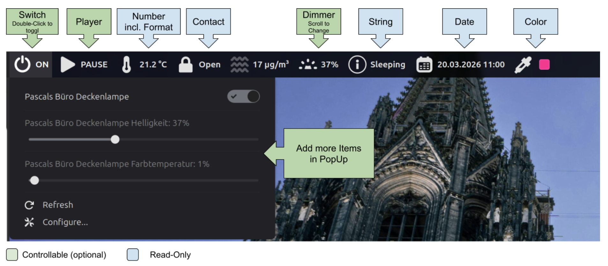

# 🏠 OpenHAB Item Applet for Cinnamon

Display and control [OpenHAB](https://www.openhab.org/) smart home items directly from your Cinnamon desktop panel.

## ✨ Features

- 🔁 **Multi-instance** — Add the applet multiple times to monitor different items
- 🔗 **Shared configuration** — Configure the OpenHAB server URL once, all instances share it
- 🎛️ **Rich item support** — Switch, Dimmer, Rollershutter, Color, Player, and read-only types like Number, String, Contact, DateTime, and Group
- ➕ **Additional items** — Show related items in the popup (e.g. lamp switch + brightness dimmer together)
- 👆 **Double-click toggle** — Quickly toggle Switch/Dimmer items without opening the menu
- 🖱️ **Scroll-wheel dimmer** — Control brightness by scrolling directly on the panel — no popup needed (auto-populated for Dimmer items)
- 🎨 **Configurable display** — Choose what to show on the panel (icon, label, state) with a custom format string and configurable tooltip
- 🔒 **Read-only mode** — Disable all controls to use the applet as a display-only monitor
- ⏱️ **Auto-close popup** — Popup menu auto-closes after a configurable timeout
- 🔄 **Auto-polling** — Configurable refresh interval (1–300 seconds)

## 📋 Supported Item Types

| Type | Panel Display | Controls |
|------|--------------|----------|
| Switch | ON / OFF | Toggle switch |
| Dimmer | Percentage | Brightness slider (optional ON/OFF toggle) |
| Number | Formatted value | Read-only |
| String | Text | Read-only |
| Contact | Open / Closed | Read-only |
| Rollershutter | Position % | UP / STOP / DOWN + slider |
| Color | Color swatch + brightness % | ON/OFF toggle, color preview, brightness slider |
| DateTime | Formatted (supports OpenHAB patterns) | Read-only |
| Player | Play state | Play / Pause / Next / Previous |
| Group | Aggregated value (AVG, SUM, etc.) | Read-only |

## 🛠️ Configuration

Right-click the applet → **Configure...** to access settings across three tabs.

### 🌐 Server Settings (shared across all instances)

| Setting | Description | Default |
|---------|-------------|---------|
| Server URL | OpenHAB server URL (e.g. `http://openhabianpi:8080`) | *(empty)* |
| API Token | Bearer token for authentication (optional) | *(empty)* |
| Poll Interval | How often to refresh item state, in seconds | 30 |

### 📦 Item Settings (per instance)

| Setting | Description | Default |
|---------|-------------|---------|
| Item Name | Exact OpenHAB item name (e.g. `LivingRoom_Light`) | *(empty)* |
| Custom Label | Override the item label from OpenHAB | *(empty)* |
| Additional Items | Comma-separated item names to show in popup | *(empty)* |
| Scroll-wheel Dimmer Item | Item to control via scroll wheel on the panel | *(auto for Dimmer)* |
| Scroll Step Size | Percentage step per scroll tick | 5% |
| Read-only Mode | Disable all controls (display only) | OFF |

### 🖥️ Display Settings (per instance)

| Setting | Description | Default |
|---------|-------------|---------|
| Show Icon | Show item type icon on the panel | ON |
| Custom Icon | Override with a custom icon (name or file path) | *(auto by type)* |
| Show Label | Show item label text on the panel | OFF |
| Show State | Show state value on the panel | ON |
| Panel Text Format | Format string using `{label}`, `{state}`, `{name}` | `{state}` |
| Double-click Toggle | Toggle Switch/Dimmer items on double-click | ON |
| Dimmer Toggle | Show ON/OFF toggle for Dimmer items in popup | OFF |
| Color Show % | Show brightness percentage on panel for Color items | ON |
| Color Swatch Width | Width of color preview swatch on panel | 16 px |
| Color Swatch Height | Height of color preview swatch on panel | 16 px |
| Auto-close Popup | Automatically close popup menu after timeout | ON |
| Auto-close Delay | Seconds before popup auto-closes | 10 |

### 💬 Tooltip Settings (per instance)

| Setting | Description | Default |
|---------|-------------|---------|
| Show Label | Show item label in tooltip | ON |
| Show Item Type | Show the OpenHAB item type | OFF |
| Show State Value | Show current state in tooltip | ON |
| Show Item Name | Show the technical item name | OFF |
| Show Server URL | Show the configured server URL | OFF |

## 🐛 Known Issues

- **Color items: no full color picker** — The Color item type currently only supports brightness control and ON/OFF toggle. Hue and saturation cannot be changed from the applet because Cinnamon's toolkit (St/Clutter) does not provide a color picker widget. Contributions welcome if you know a viable approach!

## 🧑‍💻 Development

See [CONTRIBUTING.md](CONTRIBUTING.md) for local testing, development setup, and project structure.

## 👤 Author

[phoehnel](https://github.com/phoehnel)

## 📄 License

GPL-3.0

> ⚠️ **Disclaimer:** This applet is an independent community project and is **not affiliated with, endorsed by, or supported by** the openHAB Foundation or the openHAB project. It simply interfaces with the [OpenHAB REST API](https://www.openhab.org/docs/configuration/restdocs.html).