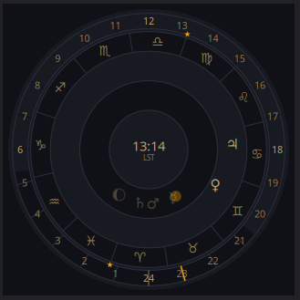

# Orloj — Cinnamon astronomical clock applet

A panel applet for the Cinnamon desktop inspired by the Prague astronomical
clock, with modern minimal aesthetics. All positions are computed locally
from your configured latitude and longitude — no network calls.



## Panel

The panel label shows the next sun and moon rise/set events:

```
☀↓21:18 ☾↑15:42
```

Arrows indicate rise (↑) or set (↓). A `+Nd` suffix appears for events
more than a day away.

## Dial

Clicking the panel label opens a 320px popup dial with concentric rings:

- **24-hour ring** — Arabic numerals reading civil (wall-clock) time.
  The daytime arc between sunrise and sunset is highlighted.
- **Zodiac ring** — twelve sign glyphs positioned at their true equatorial
  coordinates, rotating with sidereal time. Vernal and autumnal equinox
  points are marked with small stars.
- **Celestial bodies** — Sun, Moon (with phase shading), Mercury, Venus,
  Mars, Jupiter, and Saturn placed at their true sky positions. Bodies
  below the horizon are dimmed.
- **Time hand** — accent-colored hand on the hour ring showing current
  civil time.
- **Center** — local sidereal time (LST) readout.

Hover over any body for a tooltip showing its zodiac position, altitude,
and (for the Moon) illumination percentage.

## Settings

Right-click the applet and choose *Configure*:

| Setting | Description |
|---------|-------------|
| Latitude / Longitude | Observer position in decimal degrees |
| Refresh interval | How often positions are recomputed (default 30s) |
| Accent color | Color of the time hand and sun glyph |

Defaults to Prague (50.09°N, 14.42°E).

## Project structure

```
orloj@faragofr/
├── metadata.json          Cinnamon applet manifest
├── applet.js              Entry point: panel label, popup, settings, refresh loop
├── settings-schema.json   Settings UI definition
├── icon.png               Panel and applet-picker icon
├── po/
│   └── orloj@faragofr.pot Translation template
└── lib/
    ├── astronomy.js       Celestial math (Meeus/Schlyter formulas)
    ├── dial.js            Cairo/Pango dial renderer and hit-testing
    └── theme.js           Color palette and stroke constants
```
