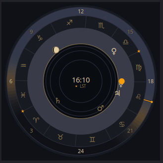

# Orloj — Cinnamon astronomical clock applet

A panel applet for the Cinnamon desktop inspired by the Prague astronomical
clock, with modern minimal aesthetics. All positions are computed locally
from your configured latitude and longitude, no network calls.



## Panel

The panel label shows the next sun and moon rise/set events:

```
☀↓21:18 ☾↑15:42
```

Arrows indicate rise (↑) or set (↓). A `+Nd` suffix marks an event N whole
days (24-hour periods) away, and `>1w` one a week or more away. `—` means
no event was found: polar day or night for the sun, or a moon that stays
above or below the horizon for the next 25 hours. `set lat/lon` means the
coordinates in the settings are not valid.

## Dial

Clicking the panel label opens the dial. From the outside in:

- **Hour ring**: civil (wall-clock) time. The ring is painted with the color
of the sky at every hour on the current day, so night, twilight and day appear
as one continuous band. The **time hand** shows the current time.
- **Equinox stars**: two stars on the inner edge of the hour ring mark
the vernal equinox and the current local sidereal time on the hour ring.
- **Zodiac ring**: the twelve signs at their true sky positions, turning
with sidereal time.
- **Sky band**: the Sun, Moon (with its phase), Mercury, Venus, Mars,
Jupiter and Saturn.
  	- Each body's angle is its position in the sky, and its distance from
  	the centre is its altitude.
  	- The circle in the middle of the band is the horizon, bodies above it
  	sit outside, bodies below it inside. The two faint circles below the
  	horizon mark -6° and -18° (end of civil and astronomical twilight).
  	- The gap between the Sun and the time hand shows the combined effect of
  	your longitude within the time zone, daylight saving time and the equation
  	of time.
- **Centre**: local sidereal time (LST).

Hover over a body for its zodiac position, altitude and, for the Moon, its
illuminated fraction. Hovering over the time hand shows the civil time.

## Settings

Right-click the applet and choose *Configure*:

| Setting | Description |
|---------|-------------|
| Latitude / Longitude | Observer position in decimal degrees, north and east positive; a decimal comma is accepted. Defaults to Prague (50.09°N, 14.42°E) |
| Refresh interval | How often the panel label and the open dial are updated (default 30 s); the label also updates at each rise or set |
| Accent color | Sun, time hand, equinox and LST stars, and the sunrise/sunset glow on the hour ring and sky band |
| Foreground color | Hour numerals, LST readout, zodiac and planet glyphs, the moon, and the dial's rules and hairlines |
| Background color | Dial background and night sky; intermediate tones are derived from it and the foreground color |
| Daylight color | Color of the fully-lit sky on the hour ring and sky band |
| Dial size | Diameter of the dial in the popup, 240–520 px (default 320) |


## Accuracy

Positions use truncated Meeus and Schlyter formulas. Compared with the JPL
DE421 ephemeris over 2026, they are within 0.8′ for the Sun, 0.17° for the
Moon and 0.14° for the planets. Over 8 sites from 55°S to 78°N, sunrise and
sunset times are within 11 seconds; moonrise and moonset times are within
14 seconds at the median and 3.5 minutes at worst.

## Project structure

```
orloj@faragofr/
├── metadata.json          Cinnamon applet manifest
├── applet.js              Entry point: panel label, popup, settings, refresh loop
├── settings-schema.json   Settings UI definition
├── icon.png               Panel and applet-picker icon
├── po/
│   ├── orloj@faragofr.pot Translation template
│   └── es.po, fr.po, hu.po, ...
└── lib/
    ├── astronomy.js       Celestial math (Meeus/Schlyter formulas)
    ├── dial.js            Cairo/Pango dial renderer and hit-testing
    └── theme.js           Color palette and stroke constants
```
