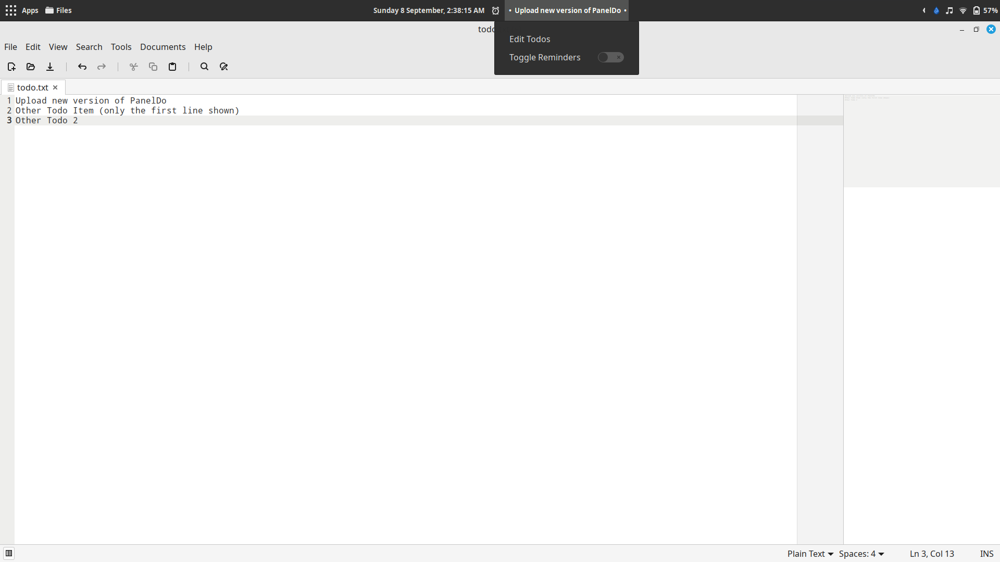
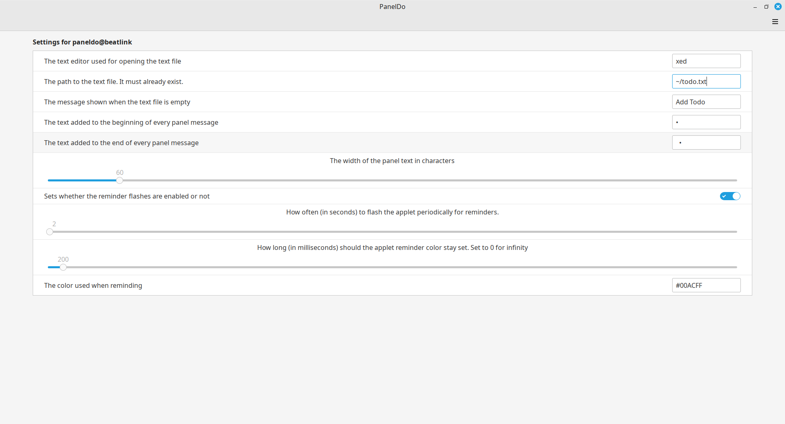

# PanelDo
Panel based todo applet for the Cinnamon desktop.

## Screenshot

The applet as it appears in the panel

The settings page

## Features
- Displays the first line of a todo text file.
- Prefixes and suffixes for displayed text are customizable
- Text file location is configurable.
- Clicking on the applet opens the text file in text editor allowing for quick editing.
- The text editor used can be configured from settings
- External changes to the file are refreshed every second.
- Periodic reminder flashes with configurable time and colors.
- Configurable text file location

## Configuration
- All customizations are via applet settings and self explanatory.

## Credits
- Applet based on todo written by Thomas Scott @threefi
- Icon is notes.png from Mint-Y Theme
