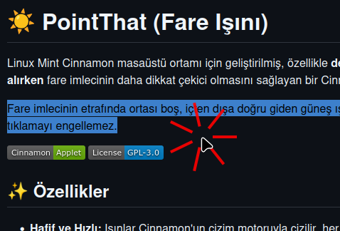
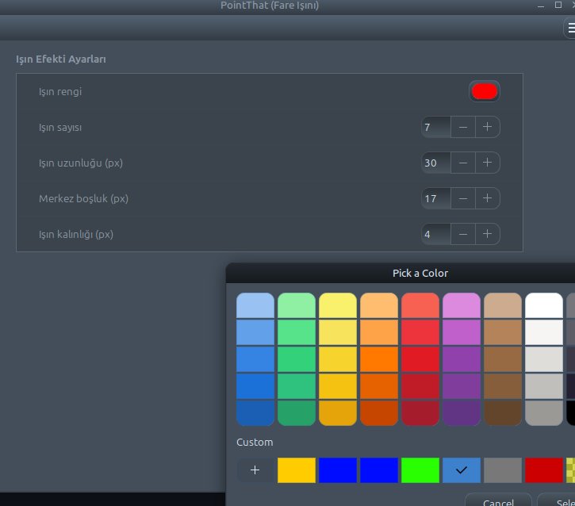

# ☀️ PointThat (Mouse Beam)

A Cinnamon applet that draws sun rays around the mouse cursor, designed for **teaching, presenting or recording your screen** so the pointer is always easy to spot.

The rays are drawn around the cursor with a hollow center and do not block clicks to the windows below.

 

## ✨ Features

* **Lightweight and Fast:** Rays are drawn with Cinnamon's drawing engine, refreshed every 16 ms (~60 FPS).
* **No Dependencies:** Uses the Cinnamon API directly (`global.get_pointer()`), no external tools like `xdotool`.
* **Non-Blocking:** The beam window is created with `reactive: false`, so mouse clicks reach the underlying windows.
* **Toggle with a Click:** Click the tray icon to turn the beam effect on/off.
* **Settings Menu:** Right-click the icon → "Configure..." to change the beam color, number, length and thickness. Values persist between sessions.

## 📦 Installation

1. Copy the files to the Cinnamon applets directory:
   ```bash
   mkdir -p ~/.local/share/cinnamon/applets/pointthat@muratozalp
   cp applet.js stylesheet.css metadata.json settings-schema.json ~/.local/share/cinnamon/applets/pointthat@muratozalp/
   ```
2. Restart Cinnamon (Alt+F2 → `r`).
3. Right-click an empty spot on the panel → Applets → add "PointThat (Mouse Beam)".

> Alternatively, install it from the Cinnamon Spices website or via System Settings once it is published.

## 🎮 Usage

* **Left Click:** Toggle the beam effect on/off.
* **Right Click:** Open the context menu ("Configure..." opens the settings).

## 🖼️ Screenshots

| Mouse pointer | Settings |
| ------------- | -------- |
|  |  |

## 🛠️ Developer Note

Written in plain JavaScript (GJS) with Cinnamon 6.x's `imports.ui.settings.AppletSettings` settings system (`settings-schema.json`). Settings are stored under `~/.config/cinnamon/spices/pointthat@muratozalp/`. If the `uuid` (`pointthat@muratozalp`) changes, the installation directory name must change accordingly.

## 📜 License

This project is licensed under the GNU General Public License v3.0.
