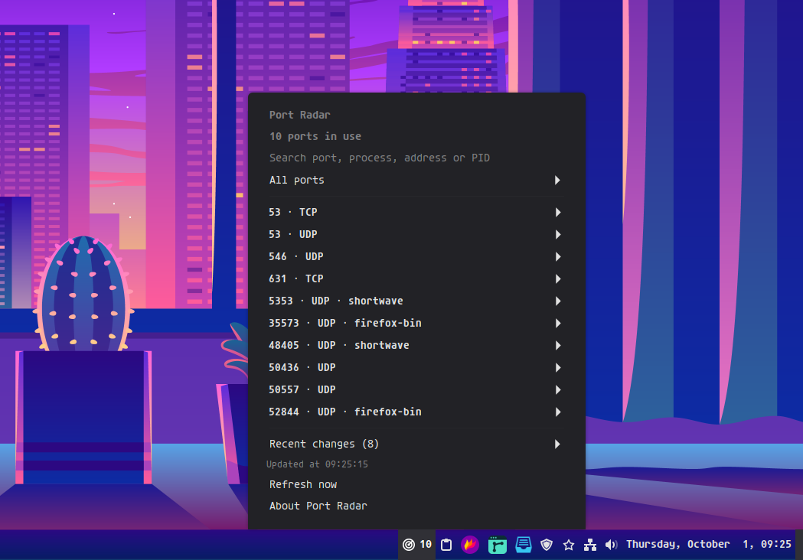

# Port Radar

View local ports and available process information directly from your Cinnamon panel.

- TCP listening and local UDP sockets, including IPv4 and IPv6.
- Search by port, process, address or PID; filter by protocol or address family.
- Recent changes, manual or automatic refresh, and an optional panel counter.
- English, Portuguese and Spanish translations.

Requires Cinnamon 6.0 or later and `ss` from your distribution's `iproute2` package. Add Port Radar through System Settings → Applets. Right-click its panel icon to configure it.

Process names and PIDs are shown only when available to your user. The applet reads local socket information without root access and does not change ports, processes or firewall settings.

By Pedro Paulo. Licensed under GPL-3.0-or-later.
