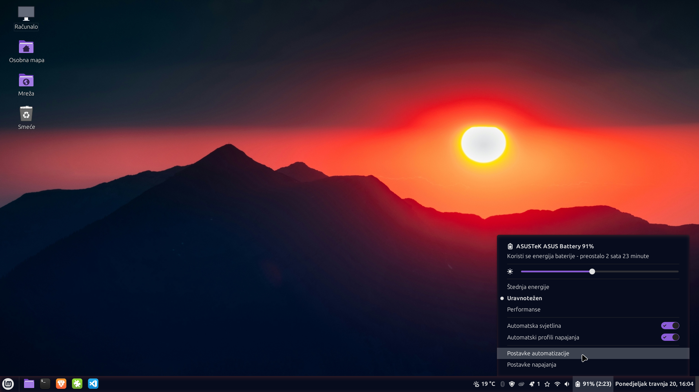

# PowerMan - Enhanced Power Manager for Cinnamon

**An enhanced power management applet for Cinnamon 6.x that extends the default power applet with automation features for brightness and power profiles. Designed primarily for laptop systems.**

## Features

### 🔋 **Enhanced Power Management**

- **Power source detection** (AC/Battery) with automatic profile switching
- **Battery level notifications** with customizable thresholds
- **Battery monitoring** with detailed device information — based on the original `power@cinnamon.org` applet

### 💡 **Automated Brightness Control**

- **Separate brightness levels** for AC power and battery operation
- **Automatic brightness switching** when power source changes
- **Idle dimming** with configurable timeout and dim levels
- **Screen and keyboard backlight** support via Cinnamon Settings Daemon

### ⚡ **Power Profile Automation**

- **Automatic power profile switching** between AC and battery modes
- **Performance mode** on AC power, **balanced/power-saver** on battery (or by user's choice in settings)
- **Low battery protection** - automatic power-saver mode when battery is low
- **Manual override** support through standard system controls

### ⚙️ **Configuration**

- Settings and options appear only when supported hardware is detected
- **System integration** - option to replace or hide alongside the default Cinnamon power applet
- **Debug logging** - for troubleshooting

## Installation

### Method 1: From Cinnamon Spices

1. Open **System Settings** → **Applets**
2. Switch to the **Download** tab
3. Search for "PowerMan" → click **Install**
4. Go back to the **Manage** tab → add PowerMan to your panel

### Method 2: Manual Installation

1. Download or clone this repository
2. Copy the `powerman@dr.drummie` folder to `~/.local/share/cinnamon/applets/`
3. Right-click on the panel → "Applets" → Find "PowerMan" → Add to panel

## Configuration

Access settings by right-clicking the applet and selecting "Configure..." or directly from applet's popup:

### **Display and Advanced**

- **Panel Display**: Choose what information to show (battery percentage, time remaining, etc.)
- **Notifications**: Enable/disable automation notifications
- **System Integration**: Replace default power applet or hide this one
- **Debug Logging**: Enable detailed logging for troubleshooting

### **Brightness Control** _(available only if brightness control detected)_

- **Automatic Brightness**: Set different levels for AC and battery power
- **Idle Dimming**: Automatically dim screen when idle

### **Power Management** _(available only if power profiles and battery detected)_

- **Profile Automation**: Different power profiles for AC/battery
- **Battery Saver**: Auto-enable power-saver mode on low battery

## Hardware Requirements

PowerMan automatically detects available hardware and shows only relevant settings:

- **Any system**: Basic power monitoring and device status (same as default Cinnamon power applet)
- **🔋 + Battery and Power profiles**: Power profile automation and battery saver depending on power source
- **💡 + Brightness control**: Automatic brightness switching depending on power source, idle dimming

## Compatibility

- **Cinnamon Desktop**: 6.0, 6.2, 6.4+ (Linux Mint and other Cinnamon-based distributions)
- **Brightness automation** requires `cinnamon-settings-daemon` — standard on Linux Mint; present on most Cinnamon-based distros. The applet auto-detects availability and disables features gracefully if not found.
- **Power profiles** require `power-profiles-daemon`

## Troubleshooting

### **Known Issues**

- If dimming is enabled and screen is dimmed (user is idle), power profile would be switched immediately, but brightness will be switched after user become active again (to avoid screen brightness dimming bugs)
- If you have dimming enabled for i.e. only battery mode, after auto switching from AC to battery, dimming would not be active until some user activity

### **Settings not appearing**

- Restart Cinnamon: `Alt+F2` → type `r` → Enter
- Check hardware detection in debug logs
- Ensure required services are running (UPower, PowerProfiles daemon)

### **Features showing as unavailable**

- Info messages explain when hardware/software requirements are not met
- Examples: "Screen brightness control is not available" or "Power profile automation is not available"
- Enable debug logging to see detailed hardware detection results

### **Brightness control not working**

- Test manual brightness: `brightnessctl` or system settings
- Restart Cinnamon Settings Daemon: `killall csd-power`
- Check if laptop supports software brightness control

### **Power profiles not switching**

- Verify power-profiles-daemon is running: `systemctl status power-profiles-daemon`
- Test manual switching: `powerprofilesctl set balanced`

## Development

Based on the original Cinnamon Power applet with enhancements like power source automation.

### **Contributing**

- Test on multiple hardware configurations
- Report issues or improvements on GitHub

### **Translation**

Translations for 17 languages are included. Most are machine-generated — corrections and improvements are welcome via PR.

**Cinnamon Spices installation**: `.po` files are automatically compiled during installation.

## License

GPL-3.0 - Based on original Cinnamon power applet code.

## Credits

- **Original Cinnamon Power Applet**: Linux Mint Team
- **Applet icon**: <a href="https://www.flaticon.com/free-icons/batteries" title="batteries icons">Batteries icons created by phatplus - Flaticon</a>
- **Inspiration**: My aged laptops with old batteries
