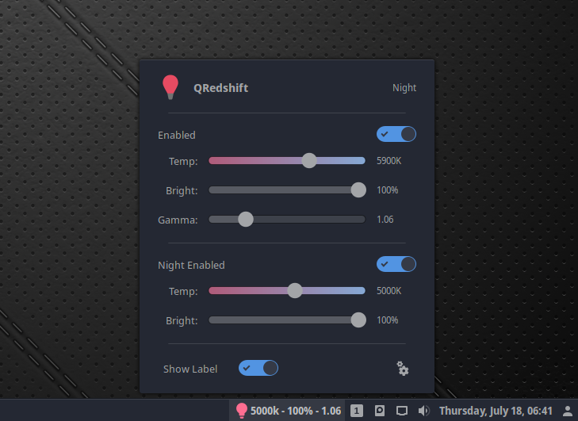
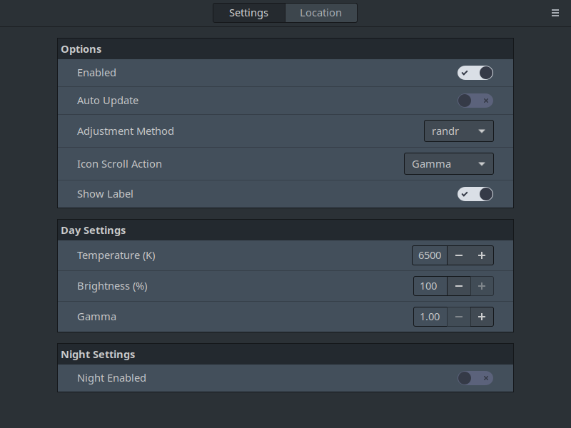
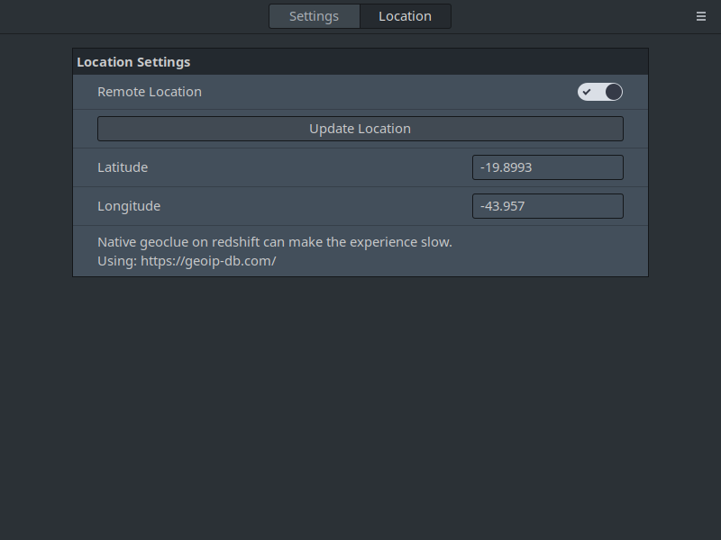

QRedshift
===
An Cinnamon applet that sets brightness, gamma levels and color temperature with Redshift.

## Features
* Powerfull Interface.
* Scroll actions on panel icon.
* Temperature from 1000k to 9000k.
* Gamma from 1 to 5.
* Custom location option.

## Installation
1. Install Redshift:
    - Debian/Ubuntu/Linux Mint: `sudo apt-get install redshift`
    - Red Hat/Cent OS/Fedora: `sudo dnf install redshift`
2. Extract .zip archive to `~/.local/share/cinnamon/applets`
3. Enable the applet in Cinnamon settings

## Screenshots

