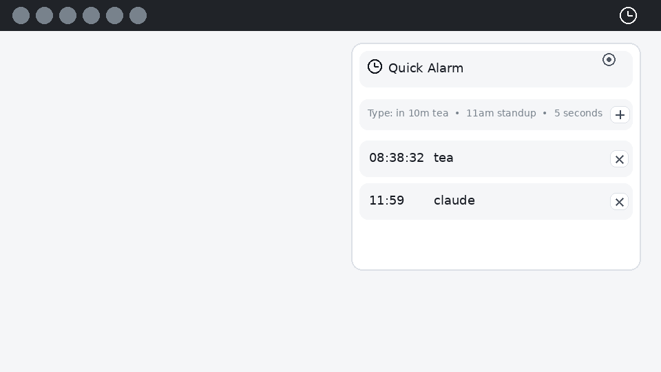

# Quick Alarm (Cinnamon Applet)

Queue alarms fast from your Cinnamon panel. Click the applet icon, type a time, press Enter.



## Usage

1. Click the applet (alarm icon) in your panel.
2. Type an alarm time (optionally with a label).
3. Press Enter (or Ctrl+Enter to add another without closing).

### Examples
- `in 10m tea`
- `after 5m - stretch`
- `5 seconds`
- `Stretch 30m`
- `11:59am claude`
- `claude at 11:59 am`
- `tomorrow 11:30 - reset`

### What happens when it fires
- A fullscreen overlay appears showing the time, label, and how long ago it fired.
- Plays an alarm sound.
- Click anywhere, press Escape/Enter/Space, or click Dismiss to close.
- If several alarms fire together, fullscreen alarms are shown one at a time.

### Sleep / wake behavior
If your computer wakes after an alarm time:
- If it’s only slightly overdue, it fires immediately.
- If it’s overdue by more than a short grace window, you get a “Missed alarm” notification (no sound) and it’s removed from the queue.

Queued alarms are saved automatically and restored after logging in or rebooting. Restored overdue alarms follow the same grace-window behavior.

## Local Install (Linux Mint / Cinnamon)
```bash
tools/install.sh
```

Restart Cinnamon (Alt+F2 → `r`), then add the applet from:
Panel Settings → Applets

## Settings
- **Show remaining time**: display countdown beside the panel icon (default: off)
- **Use a custom icon**: replace the default alarm icon with any icon file or theme icon name (default: off)
- **Fullscreen notification**: show fullscreen overlay when alarm fires (default: on)
- **Alarm sound mode**: chime once, or ring for a duration
- **Ring duration**: how long "ring" mode plays sounds
- **Open shortcut**: global hotkey to open the applet menu (default: Super+Alt+A)

## Development
- Build output: `tools/build.sh` → `applet/quick-alarm@andreas-glaser/`
- Tests: `tests/run.sh` (requires `gjs`)
- Release zip: `tools/release.sh`

## Cinnamon Spices
Publishing notes: `docs/dev/release.md`
