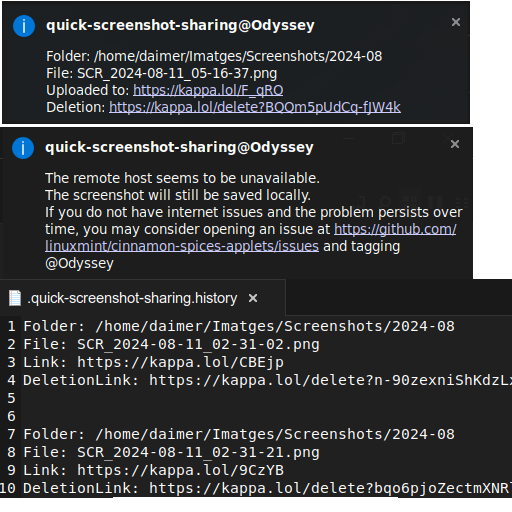

quick-screenshot-sharing
===

## Description
**quick-screenshot-sharing** allows the user to click a small camera icon on their panel and make a screenshot of the selected screen region using gnome-screenshot.

The screenshot will be stored locally in the directory ~/Pictures/Screenshots/year-month, using a structure of a new folder every new month like other screenshot apps do.

The screenshot will then be immediately uploaded to a free file hosting that requires no account or api key, that has been operating for nearly a year at the time of writing this readme.

Once uploaded, the resulting direct access link will be copied to the clipboard so it can be immediately shared with others, like many other programs allow to do (e.g: flameshot, sharex), and a notification will emerge regarding the screenshot's details.

At the same time, a history trail containing captured screenshots and their direct and deletion links will be logged at ~/quick-screenshot-sharing.history

While [the service](https://kappa.lol) is free to use and has been operating for a while, it's possible that it no longer operates at some point in the future, which would require some research in order to find another service that meets the needs of the applet with no imposed account requirements or api key limitations.

If, due to remote or local internet issues, the hosting service is unreachable, the user will be notified and the screenshots will still be saved locally at the forementioned location.

## Requirements

Many of the packages required by this applet in order to properly function are already included by default in mint. However, some of them might need to be manually installed on a per individual basis. If that's the case, the applet itself will inform the user.

However, just in case, below is a list with all packages used by this applet that some may not have installed.

```

sudo apt install xdg-user-dirs gnome-screenshot curl xclip jq

```

## Screenshots



