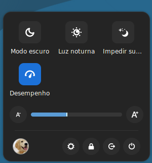

# Quick Settings (Cinnamon Applet)

**Quick Settings** is a modern and fully redesigned rework of the original \[cinnamon-user-applet].
It provides an elegant and customizable way to access your essential desktop settings directly from the Cinnamon panel.



---

## ✨ Features

* **Quick toggles** for common preferences:

  * Dark mode
  * Night light
  * Prevent sleep (inhibit suspend)
  * …and more
* **User avatar** with optional username and host display
* **Session controls** (logout, lock, shutdown, restart, etc.)
* **Highly customizable** via applet preferences
* Define **separate themes** for light and dark mode

---

## ⚙️ Preferences

All aspects of the applet can be tuned in its preferences dialog:

* Choose which toggles to display
* Enable/disable user information
* Configure session buttons
* Set light and dark mode themes

---

## 🚧 Status

This applet is still in active development.
Some **bugs are known and currently being fixed**, so please expect improvements over time.

---

## 📦 Installation

1. Clone this repository into your Cinnamon applets directory:

  ```bash
  git clone https://github.com/celiopy/cinnamon-user-applet
  cp -r cinnamon-user-applet/files/user@celiopy ~/.local/share/cinnamon/applets/
  ```
2. Enable it from **Cinnamon Settings → Applets**.
3. Configure it to your liking through the **Preferences** panel.

---

## 🙌 Acknowledgements

This project is based on and inspired by the original \[cinnamon-user-applet], but rebuilt and modernized with new design principles.