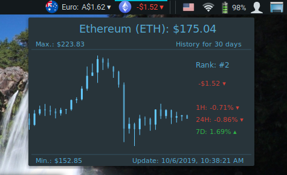

# Fiat and cryptocurrency quote rates

Displays the current price and trends of cryptocurrencies (TOP 150 coins with CoinMarketCap) and popular fiat currencies (Dollar, Euro, Ruble etc.). Monitoring daily percentage changes.

## Manual Installation

  * Download from the Spices Web Site
  * Unzip and extract folder ratecurrency@magner to
  
    For user:
    ~/.local/share/cinnamon/applets

    For system:
    /usr/share/cinnamon/applets
    
  * Enable the applet in System Settings -> Applets
  * You can also access the Settings Screen from System Settings -> Applets or from the Applets Context menu

## Localization (.mo):

  ~/.local/share/locale/${language}/LC_MESSAGES
  or
  /usr/share/locale/${language}/LC_MESSAGES

## Localization Program

Poedit
