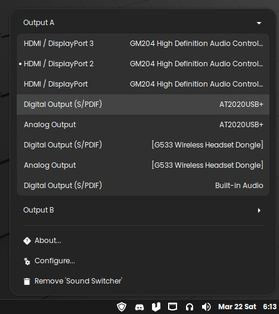

# Sound Switcher Applet

A Linux Mint Cinnamon applet that toggles between two selected audio output devices.

## Overview

This applet provides a convenient way to switch between two predefined audio output devices directly from the Cinnamon system tray. It's designed to streamline audio management, especially for users who frequently switch between headphones and speakers, or other audio output sources.

**Key Features:**

- **Quick Toggle:** Switch audio output with a single click on the tray icon or by using a user-defined keyboard shortcut.
- **Device Selection:** Easily configure the two audio output devices to toggle between through the applet's settings.
- **Visual Feedback:** The applet's icon indicates the currently active output device.

## Configuration

The configuration dialog provides the following options:

- **Shortcut:** Define a custom keyboard shortcut to toggle between the devices default is <kbd>\<super\></kbd> + <kbd>l</kbd>.
- **Device A:** Select the first audio output device.
- **Device B:** Select the second audio output device.

## Usage

- **Click the Tray Icon:** Clicking the applet icon in the system tray will immediately switch the audio output to the other configured device.
- **Use the Shortcut:** If a keyboard shortcut is configured, pressing it will toggle the audio output.

## Troubleshooting

- **Shortcut Not Working:** Ensure that the keyboard shortcut you selected is not already in use by another application.
- **Applet Not Appearing:** if the applet does not appear, try restarting cinnamon by pressing `Alt` + `F2`, typing `r` and pressing enter.

## Contributing

Contributions are welcome! If you find a bug or have an idea for a new feature, please open an issue or submit a pull request on the project's repository [IrishBruse/sound-switcher-applet](https://github.com/IrishBruse/sound-switcher-applet).

## Acknowledgements

- Inspired by the Windows application [audioswit.ch](https://audioswit.ch/er).
