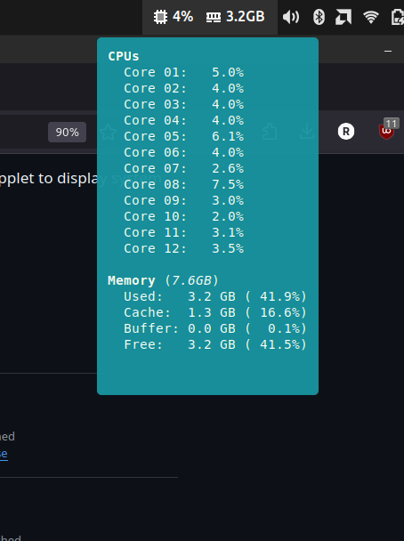

## sysmon 

A simple system monitor which displays CPU and RAM usage.

### pre-requisites

- gnome-system-monitor  : opened on left-clicking the applet.
- libgtop (GTop)        : a library for system monitoring.

### installation

copy files from the cloned repo into applet directory.
```
# inside the root directory of the repo
$ cd files

# dest is the applet directory
$ cp sysmon@rohan ~/.local/share/cinnamon/applets
```

### screenshots


### acknowledgement
applet adapted from [ssm@Sevarga](https://github.com/linuxmint/cinnamon-spices-applets/tree/master/ssm%40Severga).
