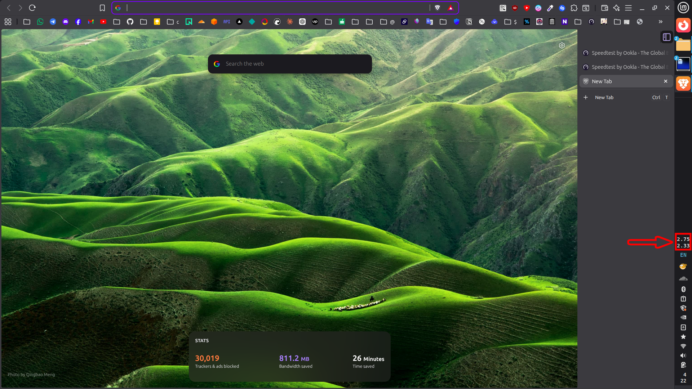

# Vertical Speedmeter

Vertical Speedmeter is a minimal Cinnamon applet that shows current network upload and download speeds in a stacked vertical label.

## Features

- Vertical two-line speed display
- Asynchronous interface detection and counter reads
- User-selectable network interface via popup menu
- No runtime writes to the applet install directory

## Layout

The applet is intended for vertical panels, but it can also load on horizontal panels.

The top line shows upload speed. The bottom line shows download speed.

The panel display is kept to a compact 3-character style:

- below `1000 KB/s`: `123`
- from `1000 KB/s` to `9999 KB/s`: `1.23`
- from `10000 KB/s`: `12.3`

## Interaction

- Left click opens a popup menu with:
  - Active interface name and live rates
  - Session totals and today totals
  - **Interface selector** — pick any detected interface or revert to auto-detect
  - `Reset Session Stats`
- Right click → **Configure** allows typing an interface name manually (useful for VPNs or bridges not listed automatically).
- Right click opens the standard Cinnamon context menu.
- The panel text stays compact and only shows live upload on the top line and download on the bottom line.

## Interface Selection

By default the applet auto-detects the primary interface via NetworkManager, falling back to `ip route get 1.1.1.1`. If the wrong interface is selected (e.g. `docker0` instead of `eno1`), open the left-click menu and pick the correct one from the **Interface** submenu. The choice is saved across restarts.

## Notes

The applet reads `/sys/class/net/<iface>/statistics/{rx_bytes,tx_bytes}`.

Interface detection order (when set to auto-detect):

- NetworkManager activated device first
- `ip route get 1.1.1.1` as fallback when NetworkManager does not provide a usable device

## Version History

### 1.1.0
- Add user-selectable network interface via left-click popup menu submenu
- Add settings support (`settings-schema.json`) for persisting interface preference
- Interface choice saved across restarts; revert to auto-detect at any time

### 1.0.0
- Initial release

## Credits

- Icon logo credit: [Tabler Icons - viewport-tall](https://tabler.io/icons/icon/viewport-tall)
- Idea/inspired from: [netspeed@iMayhem](https://github.com/linuxmint/cinnamon-spices-applets/tree/master/netspeed%40iMayhem)
