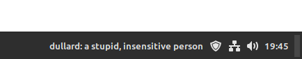

# [Vocab - A Cinnamon extension][repo]

Shows a new vocabulary on your panel everytime you boot or click on it. 

[][repo]

## Installation
### Cinnamon Spices
Download it [from here][spices] or search for _"Vocab"_ in your Cinnamon extension settings.

### From source
To download the source and install it, execute the following as a normal user (you will need [git](https://git-scm.com/)).
``` shell
$ git clone https://github.com/rizanb/cinnamon-vocab.git
```

Copy contents to: ~/.local/share/cinnamon/applets/vocab@rizanb

## Issues
If you find any bug you can file an [issue][issue] in the Github project page: 

Please explain your problem in issues- with screenshots. Feature requests are welcome, but please make them in my github and not the official Cinnamon Spices website.

## Contributing
Contributions are welcome, also in form of translations. Please, submit pull requests [to the repository][repo] not the spices repository, which is only a distribution channel (not even a mirror).

## FAQ
#### 1) Is it possible to have stats for the words I've learned?
Yes, I'm working on it. This will happen once I have some free time.

#### 2) System warns this extension isn't compatible with the current version of Cinnamon.
Probably works. If it doesn't, please file an [issue][issue].


[repo]: https://github.com/rizanb/cinnamon-vocab
[issue]: https://github.com/rizanb/cinnamon-vocab/issues