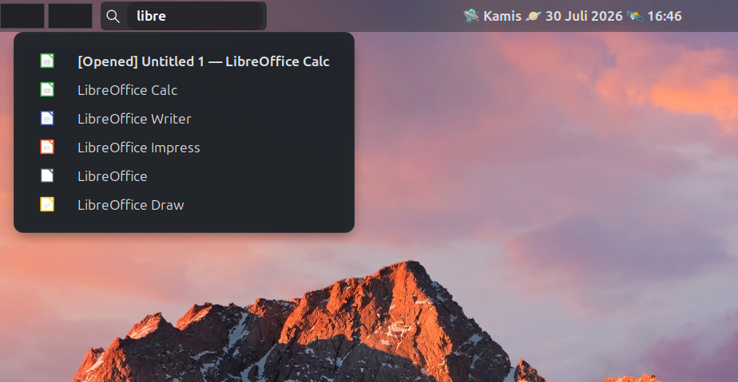

# Window Search Applet for Cinnamon

A fast, lightweight, and multi-functional search applet for the Cinnamon Desktop Environment. 

More than just a window switcher, this applet acts as a spotlight-like productivity tool directly from your panel. It allows you to switch between open windows, launch applications, calculate math expressions on the fly, and execute your custom scripts with a smart terminal runner.

## ✨ Features

*   🪟 **Window Switcher:** Instantly find and focus on currently open windows. Open windows are prioritized at the top of the list and marked with a bold `[Terbuka]` label.
*   🚀 **App Launcher:** Search and launch any installed applications on your system.
*   🧮 **On-the-Fly Calculator:** Type mathematical expressions (e.g., `12.5 * (4 + 6)`) directly into the input. The result appears instantly, and pressing `Enter` copies it directly to your clipboard.
*   📜 **Smart Script Runner:** Execute `.sh`, `.py`, and `.js` scripts directly from designated folders. The applet automatically detects the extension and runs it using the correct interpreter (`bash`, `python3`, or `node`) in your default terminal.
*   ⌨️ **Global Keyboard Shortcut:** Summon the search bar instantly without touching your mouse (Default: `Super + Q`).
*   ⚙️ **Highly Customizable:** Configure max results, script paths, search prefixes, and your preferred terminal emulator via the Cinnamon Applet Settings GUI.

## Preview

## 🛠️ Configuration

Right-click the applet icon on your panel and select **Configure** to adjust the settings:

*   **Max Results:** Limit the number of items shown in the popup list (Default: 7).
*   **Keyboard Shortcut:** Set your preferred global hotkey (Default: `<Super>q`).
*   **Script Prefix:** The trigger word to enter "Script Runner" mode (Default: `sh`). *Tip: You can change this to `run` or `cmd` to make it more universal.*
*   **Script Paths:** A comma-separated list of directories containing your scripts (e.g., `~/scripts, /usr/local/bin`).
*   **Terminal App:** The command used to launch your terminal. (Default: `x-terminal-emulator -e` for Debian/Mint based systems. Alternatively, use `gnome-terminal --`).

## 💡 Usage Guide

Once installed and placed on your panel, simply click the input box or press your keyboard shortcut (`Super + Q`), then start typing:

*   **Switch Windows:** Type the name of the app or window title (e.g., `chrome` or `youtube`).
*   **Launch Apps:** Type the name of an installed application (e.g., `calc` or `terminal`).
*   **Calculate:** Type numbers and operators directly (e.g., `100 / 4`). Press `Enter` to copy the result.
*   **Run Scripts:** Type your configured prefix followed by a space and the script name (e.g., `sh myscript`). Hit `Enter` to run it in a new terminal window.

---
*Created for the Cinnamon Desktop Environment.*
