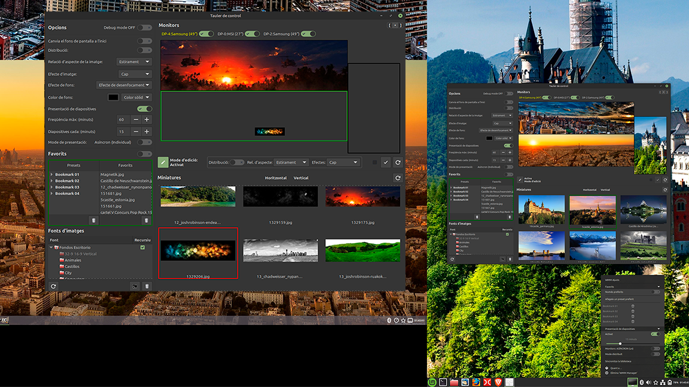

# WMM - Wallpaper Multi-Monitor Manager

Un applet para Cinnamon para la gestión de fondos de pantalla en configuraciones multi-monitor.
Olvídate de fondos deformados, recortados o repetidos.
Con WMM, tú tienes el control total.

<p align="center">
  <a href="screenshots/screenshot.png">
    
  </a>
</p>

## ✨ Características principales

*   **Gestión multi-monitor real**: Asigna fondos diferentes a cada monitor o "extiende" (spanned) una imagen panorámica por todos ellos.
*   **Asignación de imágenes**: Intenta adaptar la imagen más apropiada a cada monitor según su orientación (Vertical-Horizontal).
*   **Modos de aspecto flexibles**: Controla cómo se ajusta la imagen: `Scaled` (sin deformar), `Zoom` (llenar recortando) o `Stretched` (llenar deformando).
*   **Efectos visuales**: Aplica filtros `Sepia` o `Blanco y Negro` a las imágenes por monitor.
*   **Efectos de fondo**: Aplica filtros `Desenfoque` o `Color` al fondo si la imagen no ocupa toda el área del monitor.
*   **Rotación automática**: Configura un temporizador para cambiar los fondos automáticamente, ya sea de forma síncrona o asíncrona.
*   **Favoritos (Presets)**: Guarda tus combinaciones de fondos favoritas como "Presets" y carga la que quieras al instante.
*   **Internacionalización**: Interfaz preparada para múltiples idiomas (Inglés, Español, Catalán) con soporte para heredar traducciones del sistema.

## ⚙️ Configuración ideal del sistema

Para que WMM funcione correctamente y las transiciones de fondos sean limpias, necesita que el escritorio tenga los siguientes ajustes en Configuración del sistema → Fondos de pantalla:

| Ajuste                           | Valor necesario       | Motivo                                                        |
|----------------------------------|-----------------------|---------------------------------------------------------------|
| Relación de aspecto de la imagen | Distribuida (spanned) | Evitar que el sistema deforme o recorte la composición de WMM |
| Tipo de degradado	               | Sólido (solid)        | Evitar mezclas con otros colores durante la transición        |
| Presentación de diapositivas     | Desactivada (false)   | Evitar que el sistema interfiera en los cambios de WMM        |
|----------------------------------|-----------------------|---------------------------------------------------------------|

*   WMM intenta forzar estos ajustes automáticamente cada vez que aplica un fondo.
*   Si no puede (por ejemplo, por restricciones del sistema), te mostrará una notificación con los pasos a seguir.
*   Puedes configurarlos manualmente en cualquier momento en Configuración del sistema → Fondos de pantalla.

## 🚀 Instalación

*   Descarga o clona este repositorio en tu ordenador.

*   Abre una terminal en la carpeta raíz del proyecto (wmm-applet@maki).

*   Ejecuta el script de instalación:

    ```bash
    chmod +x install.sh
    ./install.sh
    ```

*   El script comprobará tus dependencias y te preguntará si quieres instalarlas automáticamente.

*   Activa el applet: Ve a la configuración de Applets de Cinnamon, busca "WMM - Wallpaper Multi-Monitor Manager" y actívalo.

## 🔧 Instalación manual

Si prefieres no usar el script:

*   1.  **Crea la carpeta del applet**:

    ```bash
    mkdir -p ~/.local/share/cinnamon/applets/wmm-applet@maki
    ```
*   2. Copia los archivos del proyecto en esa carpeta (el contenido del zip, no la carpeta padre)
*   3.  **Compila las traducciones**

    ```bash
    for po in po/*.po; do lang=$(basename "$po" .po); msgfmt "$po" -o ~/.local/share/locale/$lang/LC_MESSAGES/wmm-applet@maki.mo; done
    ```
*   4.  **Instalar dependencias** listadas a continuacion:
*   5.  **Activa el applet:** Ve a la configuración de Applets de Cinnamon, busca "WMM - Wallpaper Multi-Monitor Manager" y actívalo.

### 📋 Dependencias

Antes de instalar, asegúrate de tener estas dependencias. Puedes instalarlas manualmente o dejar que el script `install.sh` lo haga por ti.

| Paquete | Descripción |
|---|---|
| **Dependencias instalables** | **(se instalan con `install.sh`)** |
| `python3` | Intérprete de Python 3 |
| `python3-pillow` | Librería de manipulación de imágenes |
| `python3-numpy` | Librería de computación científica para procesado rápido de imágenes |
| `libnotify-bin` | Para enviar notificaciones de escritorio |
| **Dependencias del sistema** | **(vienen con Cinnamon)** |
| `python3-gi` | Bindings de GTK para Python |
| `python3-gi-cairo` | Bindings de Cairo para Python |
| `gir1.2-gtk-3.0` | Información de tipos para GTK+ 3.0 |
| `gir1.2-glib-2.0` | Información de tipos para GLib 2.0 |
| `gettext` | Herramientas de internacionalización |
| `zenity` | Para mostrar diálogos gráficos |
| `procps` | Para la herramienta de gestión de procesos `pkill` |

### Instalación rápida de dependencias (si no usas `install.sh`)

*   **Linux Mint / Ubuntu / Debian**:

    ```bash
    sudo apt install -y python3 python3-pillow python3-numpy libnotify-bin
    ```

*   **Fedora**:

    ```bash
    sudo dnf install -y python3 python3-pillow python3-numpy libnotify
    ```
*   **Arch Linux / Manjaro**:

    ```bash
    sudo pacman -Sy --noconfirm python python-pillow python-numpy libnotify
    ```

### 🗑️ Desinstalación

1.  Haz clic derecho en el applet del panel y selecciona **Eliminar**.
2.  Abre **Miniaplicaciones**, busca WMM Manager y pulsa **Desinstalar**.
3.  Borra la carpeta de caché:
    ```bash
    rm -rf ~/.cache/wmm
    ```
4.  Elimina cualquier acción de WMM Nemo instalada previamente.

    ```bash
    rm ~/.local/share/nemo/actions/wmm-add_to_bookmarks.nemo_action ~/.local/share/nemo/actions/wmm-send-to.nemo_action
    ```

## 🛠️ Visor de depuración / Registro de eventos

WMM incluye un sistema de registro integrado que graba la actividad del motor, el panel y los scripts en tiempo real. Puedes consultar los registros en cualquier momento sin reiniciar la aplicación.

*   **Abrir el Visor de Registros**: En el Panel de Control, haz clic en el botón **Log** (icono de documento). Se abrirá una ventana independiente que muestra los eventos del motor, el panel y las acciones de Nemo con marca de tiempo.
*   **Actualización en tiempo real**: El visor se refresca automáticamente según se escriben nuevos eventos. Usa los filtros (origen, nivel, motivo) o la barra de búsqueda para encontrar exactamente lo que necesitas.
*   **Inspección manual**: El archivo de registro se guarda en `~/.cache/wmm/debug.log`. Puedes abrirlo con cualquier editor de texto, usar el visor del panel, o ejecutar el siguiente comando para mostrarlo directamente en una terminal:

    ```bash
    python3 ~/.local/share/cinnamon/applets/wmm-applet@maki/python/debug_logger.py
    ```

El antiguo "Modo Debug" que requería una terminal ha sido eliminado. Toda la información de diagnóstico está ahora disponible a través de este sistema de registro integrado y fácil de usar.

## 🌍 Traducción

WMM soporta múltiples idiomas. Las traducciones se instalan automáticamente al ejecutar install.sh.
*   Los archivos fuente se encuentran en la carpeta locale/ del proyecto.
*   La interfaz se mostrará automáticamente en tu idioma si las traducciones están disponibles.
Si quieres ayudarnos a traducir WMM a tu idioma, ¡serás más que bienvenido!

## 📜 Licencia

WMM se distribuye bajo la licencia [GPL-3.0](LICENSE).
Eres libre de usar, modificar y distribuir este software, siempre que mantengas la misma licencia y la atribución a los autores originales.
