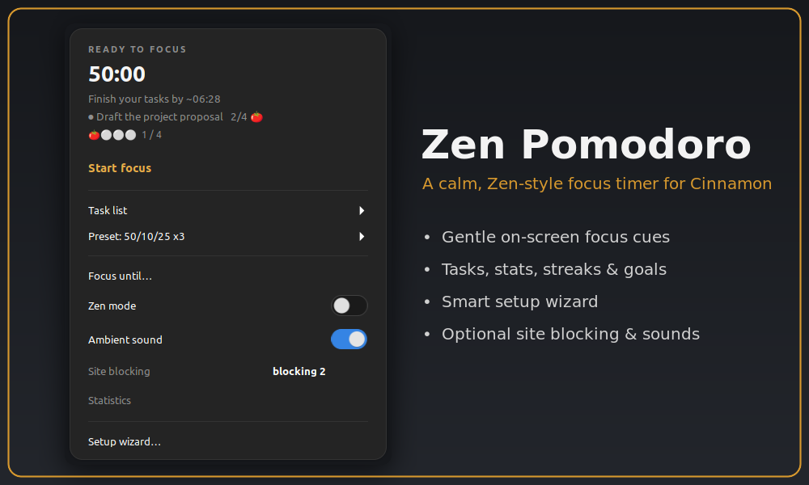
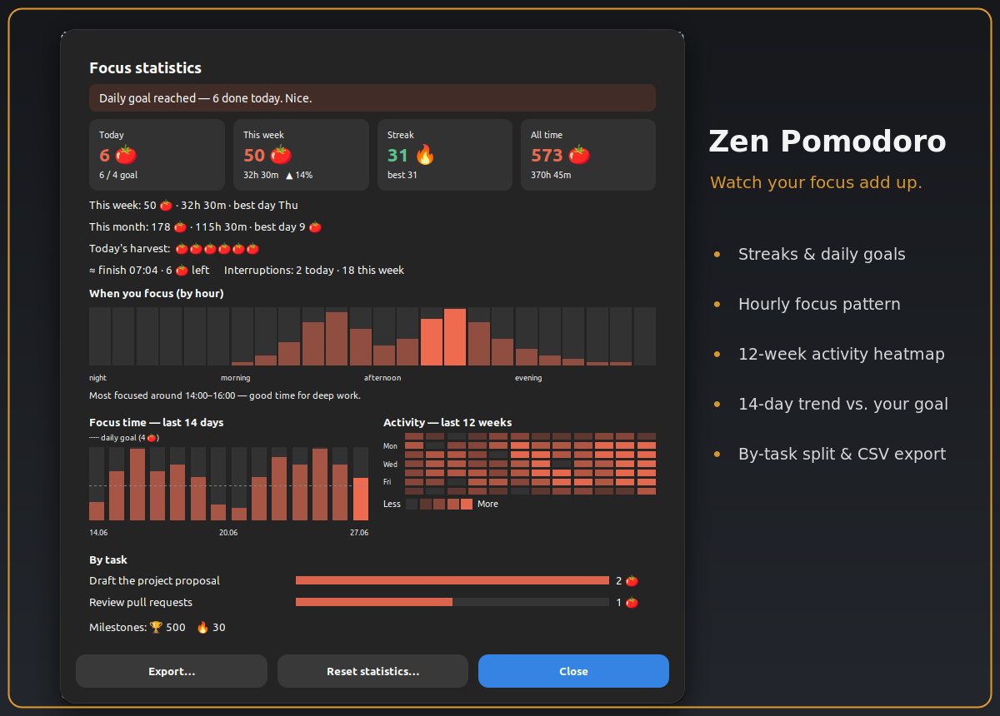

# Zen Pomodoro

A calm, Zen-style Pomodoro timer for the Cinnamon panel. It gives you gentle
on-screen cues instead of anxious alarms, so a finished block never jolts you.

## Why Zen Pomodoro?

Most Pomodoro timers interrupt you: a jarring alarm, a popup that demands a
click, a countdown that piles on pressure. Zen Pomodoro takes the opposite
approach. Your progress shows as a soft glow at the edge of the screen, focus
ends calmly instead of blinking at you, and if a block runs out while you're
mid-thought, **soft landing** waits for a natural pause instead of cutting you
off. It stays out of your way, works with a screen reader, and speaks 20
languages.

## Getting started

After enabling the applet, **right-click it → Configure** and run the short
setup wizard — it asks a few questions and tailors focus length, sounds, breaks
and optional blocking to your workflow. You can undo it with one click if you
change your mind.

## Highlights
- **Calm focus cues:** a soft edge-glow frame traces your progress (the panel
  edge stays clear), a quiet start ritual, a calm ending with no last-minute
  blinking, an optional full-screen Zen spotlight, and a breathing guide on breaks.
- **Adaptive onboarding:** a short wizard tailors focus length, sounds, breaks
  and blocking from a few questions, with a review step, keyboard and
  screen-reader navigation, and a one-click "Undo last setup".
- **Tasks:** a list with pomodoro estimates and per-task progress, templates,
  and a focus-task picker.
- **Statistics dashboard:** today, this week, this month, streak and all-time,
  an hourly focus pattern, 14-day bars, a 12-week heatmap, a by-task breakdown,
  milestones, and one-click export to a CSV file.

- **Goals & flow:** a daily goal and streak, flow-extend, soft landing, idle
  auto-pause and resume, "Focus until" a set time, and an optional strict-focus
  mode.
- **Calmer breaks:** gentle rest reminders with "+5 min" and "Skip break" right
  in the notification, an optional breathing guide, an optional lock screen on
  breaks, and auto-pause/resume of music and video (MPRIS) while you step away.
- **Stay focused:** optional site blocking during focus, Do-Not-Disturb while
  focusing, and a global hotkey to jot a distracting thought without leaving
  your flow.
- **Sounds:** ticking, phase alerts, an interval chime, and ambient soundscapes
  (white, pink or brown noise, rain, sea, fan, wind, stream or your own file).
- **Push to your phone (optional):** phase changes via Pushover with your own
  keys, and customizable message text, sound and priority.
- **Automation (optional):** run a command when focus starts, a break starts,
  or you reach your daily goal.
- **Your look and controls:** theme presets and custom accent colours, frame
  style (glow, border, corners or off), glow intensity, breathing pattern and
  menu font scale, all with a live preview; scroll on the applet to start/pause
  or change the focus length, middle-click to skip, plus keyboard shortcuts.
- **Resilient and accessible:** session recovery after a Cinnamon restart,
  screen-reader summaries for the charts, and localized into 20 languages.

## Notes
Your stats and tasks are stored locally under `~/.local/state/zen-pomodoro/`.
**Optional distraction blocking** edits a clearly marked section of `/etc/hosts`
via a pkexec prompt (standard graphical admin dialog) — off by default, and the
only feature that touches a system file. Pushover notifications require your own
credentials.

## Credits & License
Originally based on **Pomodoro Timer** by *gfreeau*, since substantially rewritten. Licensed under the **GPLv3**.
